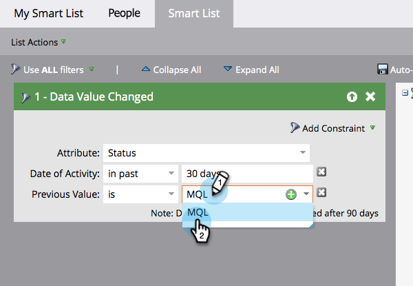

# Aggiungere un vincolo a un filtro dell’elenco avanzato {#add-a-constraint-to-a-smart-list-filter}

Durante la creazione di un elenco avanzato, alcuni filtri dispongono di opzioni avanzate denominate &quot;vincoli&quot;. Si tratta di condizioni aggiuntive che puoi aggiungere ai filtri e ai trigger per restringere ulteriormente la ricerca.

In questo esempio, aggiungiamo alcuni vincoli a un filtro **[Valore dati modificato](/help/marketo/product-docs/core-marketo-concepts/smart-campaigns/flow-actions/change-data-value.md){target="_blank"}** per trovare persone con uno stato cambiato da MQL a SQL.

>[!PREREQUISITES]
>
>* [Creare un elenco avanzato](/help/marketo/product-docs/core-marketo-concepts/smart-lists-and-static-lists/creating-a-smart-list/create-a-smart-list.md){target="_blank"}
>* [Utilizzare il filtro &quot;Valore dati modificato&quot; in un elenco avanzato](/help/marketo/product-docs/core-marketo-concepts/smart-lists-and-static-lists/using-smart-lists/use-the-data-value-changed-filter-in-a-smart-list.md){target="_blank"}

1. Vai a **[!UICONTROL Marketing Activities]**.

   

1. Selezionare l&#39;elenco avanzato con un filtro a cui aggiungere un vincolo e fare clic sulla scheda **[!UICONTROL Smart List]**.

   

1. In **[!UICONTROL Add Constraint]**, selezionare **[!UICONTROL Previous Value]**.

   

1. Immettere **[!UICONTROL Previous Value]**. In questo esempio, utilizziamo MQL.

   

1. In **[!UICONTROL Add Constraint]**, selezionare **[!UICONTROL New Value]**.

   

1. Immetti il nuovo valore. In questo esempio, utilizziamo SQL.

   

1. Ben fatto! Fare clic sulla scheda **[!UICONTROL People]** per visualizzare tutte le persone che hanno avuto un cambiamento di stato da &quot;MQL&quot; a &quot;SQL&quot; negli ultimi 30 giorni.
