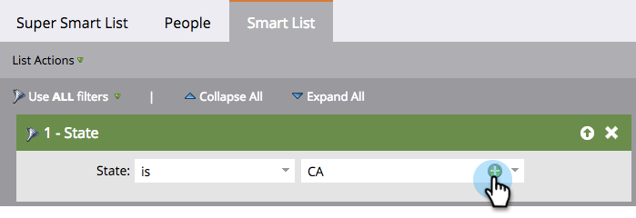

# Aggiungere più valori a un filtro elenco avanzato {#add-multiple-values-to-a-smart-list-filter}

>[!PREREQUISITES]
>
>* [Creare un elenco avanzato](/help/marketo/product-docs/core-marketo-concepts/smart-lists-and-static-lists/creating-a-smart-list/create-a-smart-list.md)
>* [Ricerca e aggiunta di filtri a un elenco avanzato](/help/marketo/product-docs/core-marketo-concepts/smart-lists-and-static-lists/creating-a-smart-list/find-and-add-filters-to-a-smart-list.md)

Supponiamo che si desideri trovare tutti in California, ma è possibile che nel database si memorizzino sia **California** che **CA**. Per includere tutte le persone applicabili, è possibile utilizzare due filtri **Stato**, ma è più facile con uno.

1. Vai a **Attività di marketing**.

   

1. Trova e seleziona un elenco avanzato e fai clic sulla scheda **Elenco avanzato** .

   

1. Fai clic su **+** sul filtro.

   

1. È possibile scegliere i valori da sinistra o digitarli semplicemente a destra, quindi fare clic su **OK**.

   

Lavoro veloce!

>[!MORELIKETHIS]
>
>* [Aggiungere un vincolo a un filtro elenco avanzato](/help/marketo/product-docs/core-marketo-concepts/smart-lists-and-static-lists/using-smart-lists/add-a-constraint-to-a-smart-list-filter.md)
>* [Utilizzare i filtri avanzati in un elenco avanzato](/help/marketo/product-docs/core-marketo-concepts/smart-lists-and-static-lists/using-smart-lists/using-advanced-smart-list-rule-logic.md)

