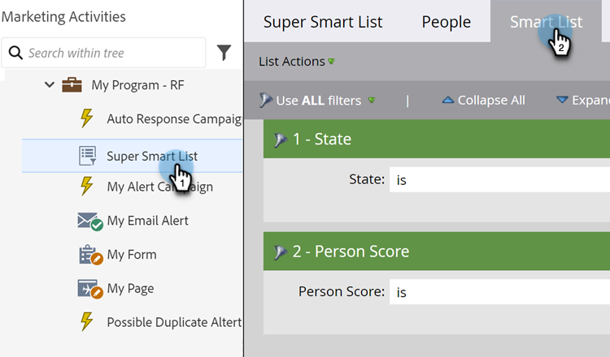
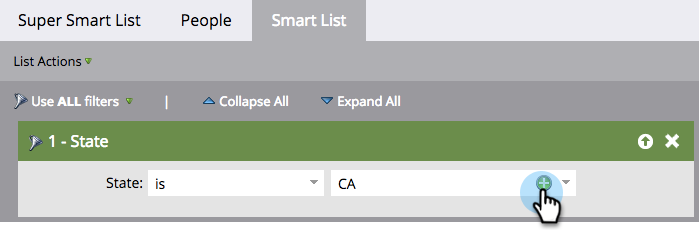

# Aggiungere più valori a un filtro dell’elenco avanzato {#add-multiple-values-to-a-smart-list-filter}

>[!PREREQUISITES]
>
>* [Creare un elenco avanzato](/help/marketo/product-docs/core-marketo-concepts/smart-lists-and-static-lists/creating-a-smart-list/create-a-smart-list.md){target="_blank"}
>* [Trova e aggiungi filtri a un elenco avanzato](/help/marketo/product-docs/core-marketo-concepts/smart-lists-and-static-lists/creating-a-smart-list/find-and-add-filters-to-a-smart-list.md){target="_blank"}

Supponiamo che tu voglia trovare tutti gli utenti in California, ma potresti archiviare sia &quot;California&quot; che &quot;CA&quot; nel tuo database. Per includere tutte le persone idonee, è possibile utilizzare due filtri [!UICONTROL State], ma è più semplice utilizzarne uno.

1. Vai a **[!UICONTROL Marketing Activities]**.

   

1. Trovare e selezionare un elenco avanzato e fare clic sulla scheda **[!UICONTROL Smart List]**.

   

1. Fare clic su **+** nel filtro.

   

1. È possibile scegliere i valori da sinistra o semplicemente digitarli a destra, quindi fare clic su **[!UICONTROL OK]**.

   

Lavoro rapido!

>[!MORELIKETHIS]
>
>* [Aggiungere un vincolo a un filtro elenchi smart](/help/marketo/product-docs/core-marketo-concepts/smart-lists-and-static-lists/using-smart-lists/add-a-constraint-to-a-smart-list-filter.md){target="_blank"}
>* [Utilizzare filtri avanzati in un elenco avanzato](/help/marketo/product-docs/core-marketo-concepts/smart-lists-and-static-lists/using-smart-lists/using-advanced-smart-list-rule-logic.md){target="_blank"}
