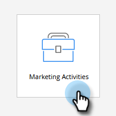

# Clonare un elenco o un elenco avanzato {#clone-a-list-or-smart-list}

Invece di creare un elenco avanzato da zero, risparmia tempo duplicandone uno simile e apportando modifiche.

1. Passa a **[!UICONTROL Marketing Activities]**.

   

1. Selezionare l&#39;elenco avanzato che si desidera clonare. In **[!UICONTROL List Actions]**, fare clic su **[!UICONTROL Clone Smart List]**.

   

1. Immettere **[!UICONTROL Name]** e fare clic su **[!UICONTROL Clone]**.

   

Allo stesso modo è possibile clonare anche gli elenchi regolari.
