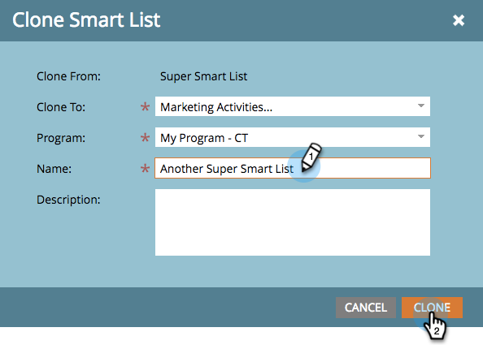

# Clonare un elenco o un elenco avanzato {#clone-a-list-or-smart-list}

Invece di creare un elenco avanzato da zero, risparmia tempo duplicandone uno simile e apportando modifiche. Ecco come.

1. Vai a **[!UICONTROL Attività di marketing]**.

   

1. Selezionare l&#39;elenco avanzato che si desidera clonare. In **[!UICONTROL Azioni elenco]**, fare clic su **[!UICONTROL Clona elenco avanzato]**.

   

1. Immetti un **[!UICONTROL Nome]** e fai clic su **[!UICONTROL Clone]**.

   

Bel lavoro! Allo stesso modo è possibile clonare anche gli elenchi regolari.
