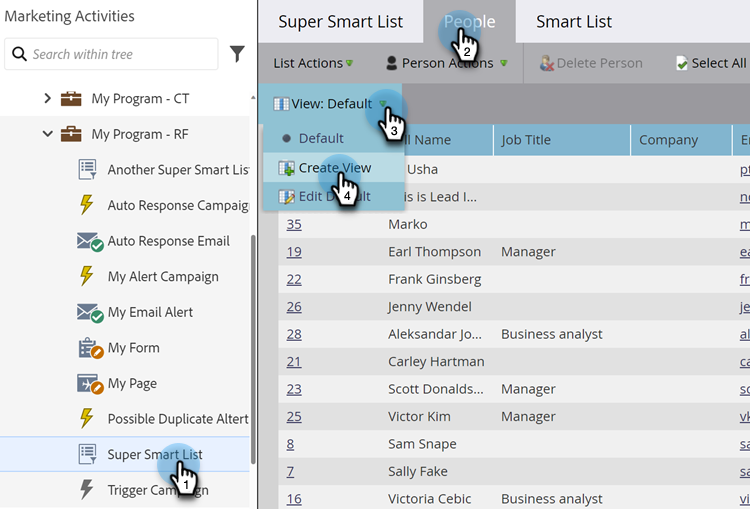

# Creare e modificare le viste per elenchi ed elenchi avanzati {#create-and-change-views-for-lists-and-smart-list}

In un elenco avanzato viene visualizzato un set predefinito di colonne. Sapevi che era possibile modificare quelle colonne nel contenuto del tuo cuore? Ecco come.

## Creare una visualizzazione {#create-a-view}

1. Passare a un elenco o a un elenco avanzato, fare clic sulla scheda **[!UICONTROL People]** e quindi su **[!UICONTROL Create View]** nel menu a discesa **[!UICONTROL View]**.

   

1. Assegna un nome alla visualizzazione e individua la colonna da aggiungere o rimuovere.

   

1. Aggiungere/rimuovere le colonne desiderate, quindi fare clic su **[!UICONTROL Create]**.

   

>[!TIP]
>
>Per eseguire ricerche rapide, utilizzare la casella **[!UICONTROL Find]**.

## Cambia visualizzazione {#switch-views}

1. Fare clic sul menu a discesa **[!UICONTROL View]**, quindi selezionare la visualizzazione desiderata. Passate avanti e indietro tra le viste, in base alle esigenze.

   

>[!NOTE]
>
> Per cambiare vista, è necessario innanzitutto creare una seconda vista, oltre a quella predefinita.

## Modificare una visualizzazione {#edit-a-view}

1. Verificare che la visualizzazione che si desidera modificare sia selezionata nel menu a discesa **[!UICONTROL View]**.

   

1. Fare clic sull'opzione **[!UICONTROL Edit]**.

   

1. Apportare le modifiche desiderate e fare clic su **[!UICONTROL Save]**.

   

## Eliminare una visualizzazione {#delete-a-view}

1. Selezionare l'opzione **[!UICONTROL Edit]** per la visualizzazione da eliminare dal menu a discesa **[!UICONTROL View]**.

   

1. Fai clic su **[!UICONTROL Delete]**.

   

Solo tu puoi visualizzare le visualizzazioni personalizzate create nel menu a discesa Visualizza, quindi informa i tuoi amici che devono crearne di proprie.

>[!MORELIKETHIS]
>
>* [Usa elenchi avanzati predefiniti/di sistema](/help/marketo/product-docs/core-marketo-concepts/smart-lists-and-static-lists/using-smart-lists/use-built-in-system-smart-lists.md){target="_blank"}
>* [Creare un elenco avanzato](/help/marketo/product-docs/core-marketo-concepts/smart-lists-and-static-lists/creating-a-smart-list/create-a-smart-list.md){target="_blank"}
