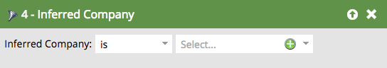

# Filtri dedotti {#inferred-filters}

Quando qualcuno visita il tuo sito Web, [Munchkin](/help/marketo/product-docs/administration/additional-integrations/add-munchkin-tracking-code-to-your-website.md){target="_blank"} lo cookie e lo inserisce nel sistema. Cerchiamo il loro IP in un database speciale e deduciamo tutti i tipi di informazioni.

>[!NOTE]
>
>Per garantire che i valori dei campi dedotti rimangano aggiornati, viene aggiornato periodicamente il database utilizzato per le ricerche degli indirizzi IP. Gli aggiornamenti del database possono introdurre nuovi valori di campo dedotti che potrebbe essere necessario aggiungere alle definizioni dei filtri di elenchi avanzati.
>
>Gli aggiornamenti del database possono verificarsi durante una [versione del prodotto Marketo Engage](/help/marketo/release-notes/release-schedule.md){target="_blank"}. Quando si verifica un aggiornamento, le [note sulla versione di Marketo Engage](/help/marketo/release-notes/current.md){target="_blank"} conterranno una spiegazione di eventuali modifiche ai valori dei campi dedotti.

Quando si utilizza uno di questi filtri in un elenco avanzato, i risultati restituiranno alle persone queste informazioni dedotte.

>[!TIP]
>
>Utilizza questi filtri in un rapporto di attività web. Utilizza i territori degli agenti di vendita e abbonali a un rapporto giornaliero personalizzato con i visitatori del sito web nelle ultime 24 ore. Loro lo ameranno!
>
>* Pagina Web visitata - Ultime 24 ore
>* Lo stato dedotto è [selezionare il proprio territorio]

Questi visitatori anonimi vengono automaticamente convertiti in persone quando fanno clic su un collegamento e-mail o compilano un modulo. Tuttavia, conservano tutte le informazioni dedotte.

>[!NOTE]
>
>Ulteriori informazioni su [attività anonima e lead](/help/marketo/product-docs/core-marketo-concepts/smart-lists-and-static-lists/managing-people-in-smart-lists/understanding-anonymous-activity-and-people.md){target="_blank"}.
