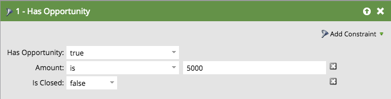

# Filtri e attivatori di opportunità {#opportunity-filters-and-triggers}

I filtri e i trigger di opportunità consentono di tenere traccia degli eventi di opportunità da [!DNL Salesforce]. Sono leggermente diversi rispetto ad altri filtri e attivatori.

## Filtri opportunità {#opportunity-filters}

I filtri opportunità consentono di analizzare in dettaglio i lead Salesforce che dispongono di opportunità. È possibile trovarli nella cartella Opportunità della tavolozza durante la modifica di un elenco avanzato. Sono disponibili in alcuni gusti.

* Numero di opzioni
* Importo opzione totale
* Ricavi previsti opzione totale
* Ha un’opportunità
* Opportunità aggiunta
* Opportunità rimossa
* L’opportunità è stata aggiornata

Se cerchi i campi Opportunità (personalizzati o standard), usa il filtro **Possiede opportunità** oppure **L&#39;opportunità era`[Added/Removed/Updated]`** filtri o trigger.

**Numero di ottavi, Importo totale dell&#39;opzione, Ricavi totali previsti dell&#39;opzione**

Con questi filtri, puoi trovare i lead in base al numero totale, all’importo o ai ricavi previsti di tutte le loro opportunità.

**Ha Un&#39;Opportunità, È Stato Aggiunto All&#39;Opportunità, È Stato Rimosso Dall&#39;Opportunità**

Se cerchi lead con opportunità basate su una combinazione di criteri, utilizza il filtro **Possibilità**, **È stato aggiunto all&#39;opportunità** o **È stato rimosso dall&#39;opportunità**. Ti dicono:

* **Ha un&#39;opportunità**: se il lead ha un&#39;opportunità corrispondente
* **È stato aggiunto all&#39;opportunità**: se questo lead è stato aggiunto a un&#39;opportunità corrispondente
* **Rimosso dall&#39;opportunità**: se il lead è stato rimosso da un&#39;opportunità corrispondente

Aggiungi i criteri di ricerca come **Vincoli** sul filtro. I vincoli includono lo standard dell’opportunità e i campi personalizzati:

Ad esempio, supponiamo che tu voglia trovare lead con opportunità aperte di almeno 5.000 dollari. Trascina nel filtro **Has Opportunity** e utilizza i vincoli **Is Closed** e **Amount**:

>[!NOTE]
>
>Quando si utilizzano più filtri opportunità, è possibile che vengano visualizzate risposte non corrette. Se hai creato l’esempio precedente con due filtri di opportunità, otterrai un elenco di lead con opportunità che sono pari ad almeno 5.000 dollari e con qualsiasi opportunità chiusa, anche se si tratta di opportunità separate.

**Opportunità aggiornata**

Il filtro **Opportunità aggiornata** cerca le opportunità quando viene aggiornato un campo opportunità specifico. Seleziona il campo da controllare con il menu a discesa Attributo trigger, quindi utilizza i vincoli per restringere l’insieme delle modifiche.

Ad esempio, questo filtro mostrerà tutti i lead per i quali è stata modificata la data di chiusura negli ultimi 30 giorni:

## Trigger opportunità {#opportunity-triggers}

Sono disponibili i seguenti trigger di opportunità. Funzionano esattamente come i filtri corrispondenti (descritti in precedenza), tranne per il fatto che possono attivare le campagne proprio quando si verifica l’evento:

* L’opportunità è aggiornata
* Aggiunto all’opportunità
* Rimosso dall’opportunità

Ad esempio, puoi utilizzare questo elenco avanzato per attivare quando un lead viene aggiunto a qualsiasi opportunità. Nel flusso, puoi aggiungerli all’elenco Marketing Sospeso o inviare loro un’e-mail mirata.

Per attivare i campi personalizzati dell&#39;opportunità, usa il trigger **Opportunity is Updated** e scegli il campo nel menu a discesa:

