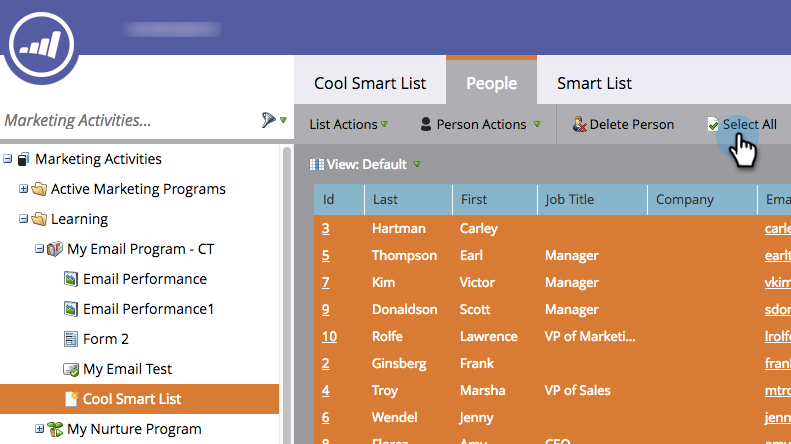

# Eseguire un singolo passaggio di flusso da un elenco avanzato {#run-a-single-flow-step-from-a-smart-list}

Se desideri eseguire un passaggio di flusso una tantum, puoi utilizzare un singolo passaggio di flusso all’interno di un elenco avanzato invece di creare un’intera campagna avanzata.

>[!PREREQUISITES]
>
>[Creare un elenco avanzato](/help/marketo/product-docs/core-marketo-concepts/smart-lists-and-static-lists/creating-a-smart-list/create-a-smart-list.md)

1. Vai a **Attività di marketing**.

   

1. Seleziona un elenco o un elenco avanzato contenente persone, quindi vai al **Persone** scheda.

   

   >[!TIP]
   >
   >Questa funzionalità è disponibile sia per gli elenchi statici che per quelli avanzati.

1. Clic **Seleziona tutto**. Puoi anche utilizzare **Ctrl/Comando** e fare clic su per selezionare alcuni record manualmente.

   

   >[!NOTE]
   >
   >Se i risultati si estendono su più pagine, fare clic su **Seleziona tutto** seleziona tutte le persone in tutte le pagine.

1. Sotto **Persona** **Azioni**, seleziona il passaggio di flusso desiderato. In questo esempio utilizzeremo [Modifica valore dati](/help/marketo/product-docs/core-marketo-concepts/smart-campaigns/flow-actions/change-data-value.md).

   

1. Trova e seleziona un **Attributo**. In questo esempio prenderemo tutte le persone che hanno lo stato &quot;California&quot; e lo cambieremo in &quot;CA&quot;.

   

1. Inserisci un nuovo valore. Clic **Esegui ora**.

   

1. Se i valori dei dati vengono modificati per un numero elevato di persone, potrebbe essere necessario confermare la modifica digitando il numero. Clic **Vai**.

   

Ottimo lavoro! Lo stato del singolo passaggio di flusso viene visualizzato nell’angolo in alto a destra.

Al termine, aggiorna l’elenco e vedrai le informazioni aggiornate.
