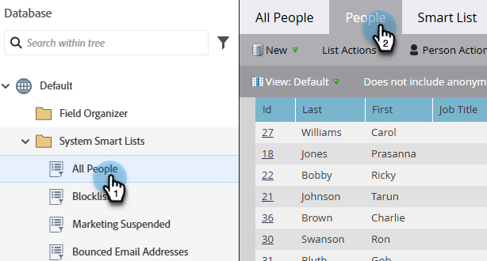

# Usa elenchi avanzati incorporati/di sistema {#use-built-in-system-smart-lists}

Il Marketo Engage dispone di alcuni elenchi avanzati incorporati molto utili. Vediamo di cosa si tratta!

1. Vai al **[!UICONTROL database]**.

   

1. Aprire la cartella **[!UICONTROL Elenchi smart di sistema]** per visualizzare la raccolta.

   

1. Per visualizzare un esempio: Seleziona **[!UICONTROL Tutte le persone]**, quindi fai clic sulla scheda **[!UICONTROL Persone]**.

   

   >[!NOTE]
   >
   >Non è necessario applicare i filtri negli elenchi avanzati di sistema a ciascun elenco avanzato/campagna. Il loro contenuto viene riconosciuto automaticamente.

Di seguito è riportato un riepilogo delle operazioni eseguite dagli elenchi avanzati incorporati:

<table><thead>
  <tr>
    <th>Nome elenco</th>
    <th>Descrizione</th>
  </tr></thead>
<tbody>
  <tr>
    <td>Tutte le persone</td>
    <td>Tutti gli utenti nel database di Marketo</td>
  </tr>
  <tr>
    <td>Persone non abbonate</td>
    <td>A queste persone possono essere inviate solo e-mail operative; solitamente sono controllate dalla persona stessa.</td>
  </tr>
  <tr>
    <td>Marketing sospeso</td>
    <td>A queste persone possono essere inviate solo e-mail operative, che in genere sono controllate da te, l’addetto al marketing.</td>
  </tr>
  <tr>
    <td>INSERISCO NELL'ELENCO BLOCCATI DI</td>
    <td>Queste persone non riceveranno alcuna e-mail.</td>
  </tr>
  <tr>
    <td>Indirizzi e-mail non recapitati</td>
    <td>Persone con un indirizzo e-mail non recapitabile o che rifiutano l’e-mail.</td>
  </tr>
  <tr>
    <td>Possibili duplicati</td>
    <td>Persone che potrebbero essere duplicate nel database di Marketo.</td>
  </tr>
</tbody>
</table>

>[!NOTE]
>
>Impossibile eliminare gli elenchi smart di sistema. Ad eccezione dell’elenco Possibili duplicati, non possono essere modificati.

>[!MORELIKETHIS]
>
>[Creare un elenco avanzato](/help/marketo/product-docs/core-marketo-concepts/smart-lists-and-static-lists/creating-a-smart-list/create-a-smart-list.md){target="_blank"}
