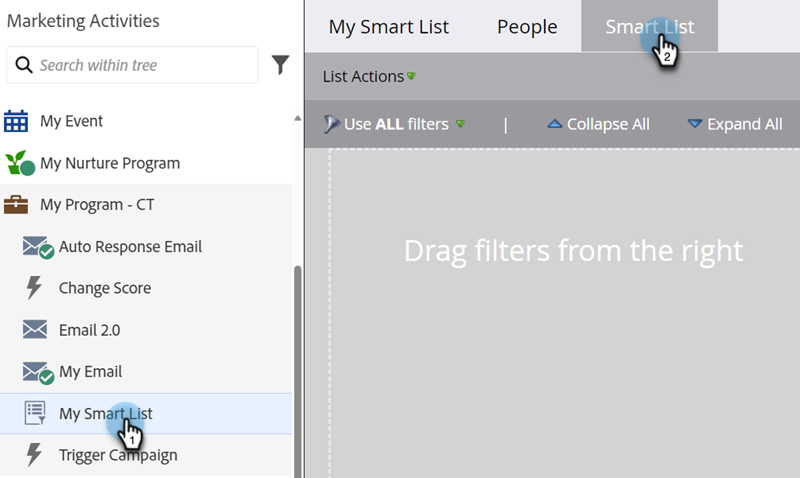

# Utilizzare il filtro Valore dati modificato in un elenco avanzato {#use-the-data-value-changed-filter-in-a-smart-list}

I valori cambiano e vengono aggiornati costantemente nel database di Marketo. A volte, invece di cercare un valore specifico, è meglio cercare le persone che hanno avuto una variazione di valore. Ecco come.

>[!PREREQUISITES]
>
>[Creare un elenco avanzato](/help/marketo/product-docs/core-marketo-concepts/smart-lists-and-static-lists/creating-a-smart-list/create-a-smart-list.md){target="_blank"}

1. Vai all&#39;area **[!UICONTROL Attività di marketing]**.

   

1. Selezionare l&#39;elenco avanzato e fare clic sulla scheda **[!UICONTROL Elenco avanzato]**.

   

1. Trovare il filtro **[!UICONTROL Valore dati modificato]** e trascinarlo nell&#39;area di lavoro.

   

1. Imposta **[!UICONTROL Attributo]** sul campo in cui desideri cercare le modifiche al valore dei dati.

   

Questo filtro cercherà tutte le persone il cui Stato è stato modificato (o modificato). Per ottenere informazioni ancora più dettagliate, prova ad [aggiungere un vincolo a un filtro per elenchi avanzati](/help/marketo/product-docs/core-marketo-concepts/smart-lists-and-static-lists/using-smart-lists/add-a-constraint-to-a-smart-list-filter.md){target="_blank"}.
