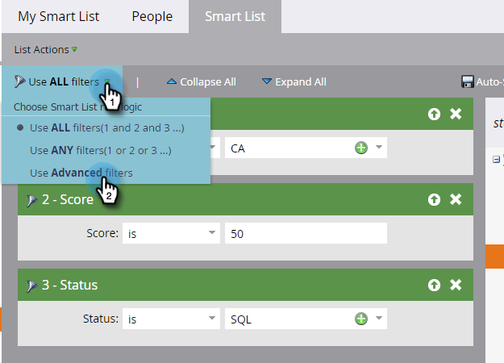
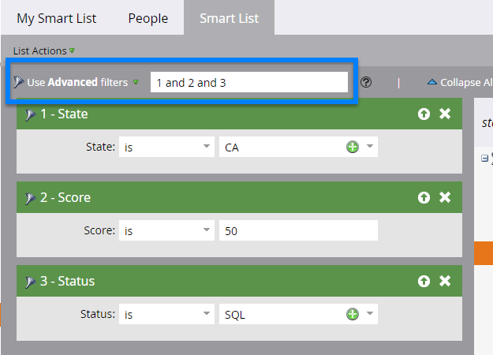
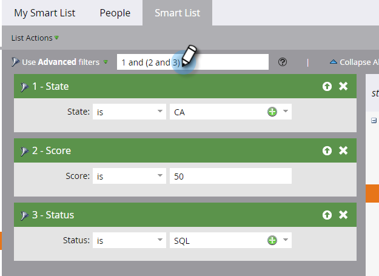
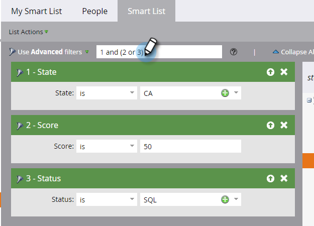
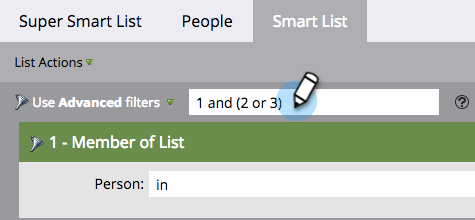
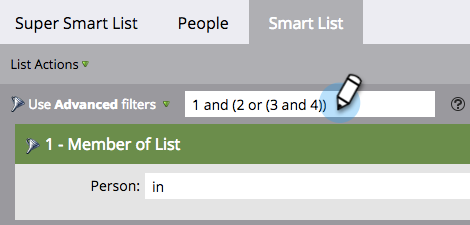

# Utilizzare la logica avanzata per le regole di elenchi avanzati {#using-advanced-smart-list-rule-logic}

Per trovare le persone necessarie, applica la logica della regola Elenco avanzato a più filtri all’interno di un Elenco avanzato.

>[!PREREQUISITES]
>
>* [Trova e aggiungi filtri a un elenco avanzato](/help/marketo/product-docs/core-marketo-concepts/smart-lists-and-static-lists/creating-a-smart-list/find-and-add-filters-to-a-smart-list.md){target="_blank"}
>* [Definisci filtri elenchi avanzati](/help/marketo/product-docs/core-marketo-concepts/smart-lists-and-static-lists/creating-a-smart-list/define-smart-list-filters.md){target="_blank"}

>[!NOTE]
>
>La logica di filtro avanzata è disponibile solo se nell’elenco avanzato sono presenti tre o più filtri.

## Aggiungere logica a un elenco avanzato {#add-logic-to-a-smart-list}

Per impostazione predefinita, il tuo elenco avanzato troverà le persone che corrispondono ai filtri **[!UICONTROL ALL]** (filtri 1 _e_ 2 _e_ 3). È possibile modificare la logica della regola per trovare persone che corrispondono a **[!UICONTROL ANY]** dei filtri definiti (filtri 1 _or_ 2 _or_ 3) o utilizzare filtri avanzati (filtri 1 _and_ 2 _or_ 3).

In questo esempio, supponiamo che si desideri trovare persone in California _e_ con un punteggio di almeno 50 punti _o_ con uno stato di &quot;qualificato per le vendite&quot;.

1. Selezionare **[!UICONTROL Use Advanced filters]** dal menu a discesa.

   

   >[!NOTE]
   >
   >L&#39;utilizzo dei filtri **[!UICONTROL Advanced]** riduce la necessità di creare elenchi smart con il filtro Membro di elenco smart. Questo consente di ottimizzare le prestazioni.

1. Nella casella di testo **[!UICONTROL Advanced filters]** verrà visualizzato &quot;and&quot; come valore predefinito tra tutti i filtri.

   

1. Digita una coppia di parentesi intorno a &quot;2 e 3&quot;.

   

   >[!CAUTION]
   >
   >Utilizza &quot;e&quot; prima di &quot;o&quot; quando immetti la logica della regola.

1. Modificare &quot;and&quot; tra &quot;2 e 3&quot; in &quot;or&quot;.

   

## Utilizzare Le Parentesi Quando Si Miscelano &quot;And&quot; E &quot;Or&quot; {#use-parentheses-when-mixing-and-and-or}

La combinazione delle logiche &quot;and&quot; e &quot;or&quot; richiede parentesi per rendere chiara la tua intenzione.

## Usa parentesi nidificate per quattro o più filtri, se necessario {#use-nested-parentheses-for-four-or-more-filters-if-needed}

A seconda dell’intenzione, potrebbe essere necessario aggiungere parentesi nidificate quando si utilizzano quattro o più filtri.

>[!TIP]
>
>Se si immette una regola non valida, sotto la regola verrà visualizzata una riga rossa. Scorri il testo per visualizzare il relativo messaggio di errore.
