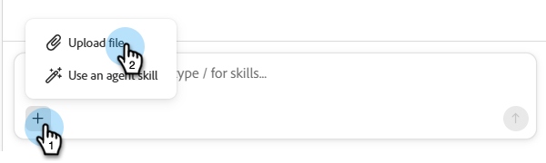
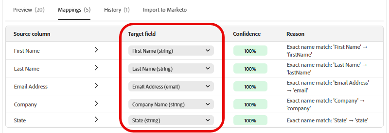

# Importa lead {#import-leads}

Importare e deduplicare gli elenchi di lead nel database di Marketo Engage con assistenza per la mappatura dei campi.

## Come usare {#how-to-use}

1. Nel tuo My Marketo, fai clic sul riquadro **Collaboratore per Marketo Engage**.

   

1. Digitare &quot;Import a lead list and normalize the data&quot; (Importare un elenco di lead e normalizzare i dati) (o selezionarlo se è elencato come prompt di esempio) e fare clic sull&#39;icona freccia su.

   

1. Viene richiesto di caricare il file CSV e vengono mostrati i passaggi successivi.

   

1. Fai clic sull&#39;icona **+** e seleziona **Carica file**. Trova e carica il tuo file CSV.

   

1. Fare clic sull&#39;icona freccia su.

   

1. Fai clic su **Rivedi** per visualizzare l&#39;elenco nella console centrale.

   

1. Controlla le regole business disponibili per pulire l’elenco. Immettere il valore desiderato e fare clic sull&#39;icona freccia su.

   

   I risultati vengono visualizzati nella console centrale.

   

   Se lo si desidera, immettere ulteriori regole business.

1. Per visualizzare i campi mappati, fai clic sulla scheda **Mappature**.

1. Se alcuni campi non sono stati mappati correttamente, correggerli qui modificando il **campo di destinazione**.

   

1. Al termine dell&#39;importazione dell&#39;elenco, fare clic sulla scheda **Importa in Marketo**.

1. Seleziona la cartella di destinazione e immetti un nome. Seleziona ogni casella di consenso e fai clic su **Inizia importazione**.

   

   Al termine dell’importazione, viene visualizzato un riepilogo di verifica che mostra i lead elaborati, le righe non riuscite ed eventuali avvisi.
