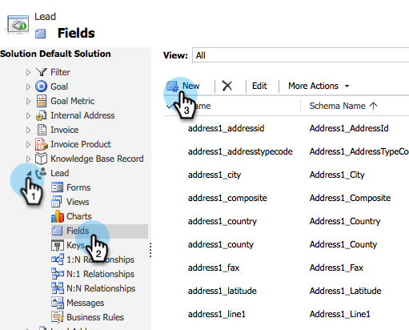
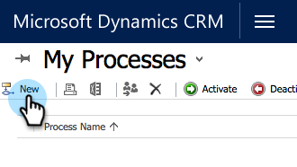

# Creare un filtro di sincronizzazione Dynamics personalizzato {#create-a-custom-dynamics-sync-filter}

Non sincronizzare tutto il contenuto di Dynamics CRM in Marketo? Non si preoccupi! Marketo consente di impostare un filtro di sincronizzazione e di sincronizzare solo una parte dei record.

## Panoramica {#overview}

Per impostare un filtro di sincronizzazione Dynamics:

1. Crea un campo personalizzato con due opzioni (booleano) denominato new_synctomkto in Dynamics CRM per qualsiasi oggetto (lead, contatto, account, opportunità e altre entità personalizzate).
1. Assegnare un valore Sì/No a questo campo o lasciarlo vuoto.

>[!NOTE]
>
>È necessario apportare queste modifiche in Dynamics CRM, non nel database o in Marketo.

Marketo cerca questo campo durante la sincronizzazione in background automatica e determina quali record sincronizzare in base a questa logica:

| Valore campo | Sincronizzare con Marketo? |
|---|---|
| Il campo non esiste | Sì |
| Il campo è vuoto | Sì |
| Il campo ha valore Sì | Sì |
| Campo con valore No | No |

>[!CAUTION]
>
>L’unico modo per dire a Marketo di saltare un record è impostare esplicitamente il valore del campo su **No**. Marketo sincronizza comunque i record anche se i valori dei campi sono vuoti.

>[!PREREQUISITES]
>
>Installa la versione più recente del plug-in Marketo (3.0.0.1 o successiva). Vai a Marketo > Admin > Microsoft Dynamics > Download della soluzione Marketo.

## Crea campo SyncToMkto {#create-synctomkto-field}

1. Accedi a Dynamics CRM. Clic **Impostazioni** e quindi fare clic su **Personalizzazioni**.

   

1. Clic **Personalizzare il sistema**.

   

1. Clic  accanto a **Entità**.

   

1. Clic  accanto a **Lead** e seleziona **Campi**. Quindi fai clic su **Nuovo**.

   

1. Invio **SyncToMkto** nel **Nome visualizzato** e seleziona **Due opzioni** come **Tipo di dati**. Quindi fai clic su **Salva e chiudi**.

   

   >[!NOTE]
   >
   >Scegliere un nome visualizzato per questo campo, ma il campo Nome deve essere esattamente **new_synctomkto**. È necessario utilizzare **nuovo** come prefisso predefinito. Se hai modificato il valore predefinito, vai qui per [reimpostare il prefisso predefinito per i nomi dei campi personalizzati](/help/marketo/product-docs/crm-sync/microsoft-dynamics-sync/create-a-custom-dynamics-sync-filter/set-a-default-custom-field-prefix.md). Puoi ripristinarla dopo aver creato i nuovi campi.

   >[!NOTE]
   >
   >Se è stato configurato un flusso di lavoro asincrono, il record ottiene il valore SyncToMkto predefinito impostato nel campo e ottiene il valore corretto alcuni secondi dopo al termine dell&#39;esecuzione del flusso di lavoro. Se il valore predefinito è impostato su Sì, tali record verranno creati in Marketo e quindi diventeranno obsoleti. Utilizzare **No** come valore predefinito per evitare questo inconveniente.

1. Ripeti questo processo e crea il **SyncToMkto** per qualsiasi altra entità su cui desideri limitare la sincronizzazione, ad esempio contatto, account, opportunità ed entità personalizzate.

## Selezionare il filtro in Marketo {#select-the-filter-in-marketo}

Anche se la sincronizzazione iniziale è già stata eseguita, accedere e selezionare i campi da sincronizzare con Marketo.

1. Vai a Amministratore e seleziona **Microsoft Dynamics**.

   

1. Clic **Modifica** in Dettagli sincronizzazione campi.

   

1. Scorri verso il basso fino al campo e selezionalo. Il nome effettivo deve essere new_synctomkto, ma il nome visualizzato può essere qualsiasi cosa. Clic **Salva**.

   

Bene, ora hai attivato il filtro di sincronizzazione per Marketo.

## Creare un flusso di lavoro Dynamics per assegnare automaticamente i valori del filtro di sincronizzazione {#create-a-dynamics-workflow-to-assign-sync-filter-values-automatically}

È sempre possibile assegnare manualmente un valore ai campi SyncToMkto dei record. Ma perché non sfruttare la potenza di un flusso di lavoro Dynamics e assegnare automaticamente un valore al campo SyncToMkto quando un record viene creato o aggiornato?

>[!NOTE]
>
>Impossibile eseguire questa operazione a livello di database. Deve essere eseguito nel CRM manualmente o utilizzando un flusso di lavoro.
>
>Un flusso di lavoro Dynamics funziona solo sui nuovi record creati in futuro, non sui dati storici. Utilizzare un aggiornamento batch per spostarsi sui record esistenti.

1. Passare a Dynamics CRM. Clic **Impostazioni** quindi fai clic su **Processi**.

   

1. Clic **Nuovo**.

   

1. Immetti un nome per il flusso di lavoro e seleziona **Flusso di lavoro** come categoria e **Lead** come Entità. Quindi fai clic su **OK**.

   

1. Creare regole per assegnare un valore true o false al **SyncToMkto** in base alle preferenze della tua organizzazione. Clic **Salva e chiudi**.

   

   >[!NOTE]
   >
   >Definisci un&#39;azione predefinita dopo aver fatto clic su **Aggiungi passaggio** per aggiungere una condizione Check. Imposta i record a cui non si desidera sincronizzare **No**. In caso contrario, verranno sincronizzati.

1. Seleziona il flusso di lavoro e fai clic su **Attiva**.

   

   >[!TIP]
   >
   >Consulta [Regole filtro di sincronizzazione personalizzate per un indirizzo e-mail](/help/marketo/product-docs/crm-sync/microsoft-dynamics-sync/create-a-custom-dynamics-sync-filter/custom-sync-filter-rules-for-an-email-address.md) per impostare regole per sincronizzare solo i record per le persone con indirizzi e-mail.

## Dettagli filtro di sincronizzazione {#sync-filter-details}

Di seguito sono riportati alcuni dettagli di implementazione che pensavamo dovessi conoscere:

1. Avvia un&#39;operazione di sincronizzazione

   Quando **SyncToMkto** il valore cambia da **No** a **Sì**, Dynamics notifica immediatamente a Marketo l&#39;avvio della sincronizzazione del record. Se il record esiste già, Marketo lo aggiorna. In caso contrario, Marketo crea il record.

   >[!TIP]
   >
   >A `Create [StartSync]` Questa operazione viene aggiunta al registro di Marketo quando ciò accade.

1. Interrompere un&#39;operazione di sincronizzazione

   Quando il valore SyncToMkto di un record viene modificato da Sì a No, a Marketo viene notificato di interrompere la sincronizzazione del record. Tuttavia, il record non viene eliminato, ma smette di ricevere aggiornamenti e diventa obsoleto.

>[!MORELIKETHIS]
>
>* [Filtro sincronizzazione Microsoft Dynamics: qualificato](/help/marketo/product-docs/crm-sync/microsoft-dynamics-sync/create-a-custom-dynamics-sync-filter/microsoft-dynamics-sync-filter-qualify.md)
>* [Filtro sincronizzazione Microsoft Dynamics: Unisci](/help/marketo/product-docs/crm-sync/microsoft-dynamics-sync/create-a-custom-dynamics-sync-filter/microsoft-dynamics-sync-filter-merge.md)
>* [Regole filtro di sincronizzazione personalizzate per un indirizzo e-mail](/help/marketo/product-docs/crm-sync/microsoft-dynamics-sync/create-a-custom-dynamics-sync-filter/custom-sync-filter-rules-for-an-email-address.md)
