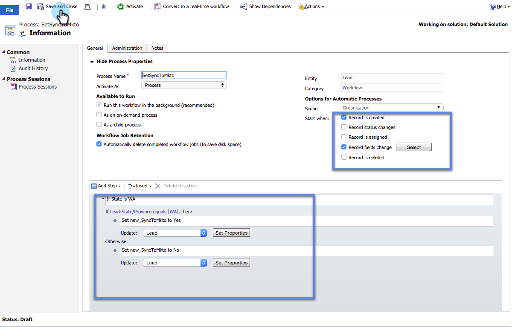

# Creare un filtro di sincronizzazione dinamica personalizzato {#create-a-custom-dynamics-sync-filter}

Non vuoi sincronizzare tutti gli elementi di Dynamics CRM in Marketo? Non preoccuparti! Marketo consente di impostare un filtro di sincronizzazione e di sincronizzare solo una parte dei record.

## Panoramica {#overview}

Per impostare un filtro di sincronizzazione Dynamics:

1. Crea un campo personalizzato con due opzioni (booleano) denominato new_synctomkto in Dynamics CRM per qualsiasi oggetto (lead, contatto, account, opportunità e altre entità personalizzate).
1. Assegnare un valore Sì/No o lasciare vuoto il campo.

>[!NOTE]
>
>Devi apportare queste modifiche in Dynamics CRM, non nel database o in Marketo.

Marketo cerca questo campo durante la sincronizzazione automatica in background e determina su quali record sincronizzare in base a questa logica:

| Valore campo | Sincronizza con Marketo? |
|---|---|
| Il campo non esiste | Yes |
| Campo vuoto | Yes |
| Il campo ha il valore Sì | Yes |
| Il campo ha valore No | No |

>[!CAUTION]
>
>L&#39;unico modo per indicare a Marketo di saltare un record è impostare il valore del campo in modo esplicito su **No**. Marketo sincronizza ancora i record anche se i valori dei campi sono vuoti.

>[!PREREQUISITES]
>
>Installate la versione più recente del plug-in Marketo (3.0.0.1 o versione successiva). Vai a Marketing > Amministratore > Microsoft Dynamics > Scarica soluzione Marketo.

## Crea campo SyncToMkto {#create-synctomkto-field}

1. Accedi a Dynamics CRM. Fare clic su **Impostazioni**, quindi fare clic su **Personalizzazioni**.

   

1. Fare clic su **Personalizza il sistema**.

   

1. Fare clic su  accanto a **Entità**.

   

1. Fare clic su  accanto a **Lead **e selezionare **Campi**. Fare clic su **Nuovo**.

   

1. Immettere **SyncToMkto** nel campo **Nome visualizzato** e selezionare **Due opzioni** come **Tipo di dati**. Fare clic su **Salva e chiudi**.

   

   >[!NOTE]
   >
   >Scegliere un nome visualizzato per questo campo, ma il campo Nome deve essere esattamente **new_synctomkto**. È necessario utilizzare **new** come prefisso predefinito. Se avete modificato il valore predefinito, andate qui a [reimpostare il prefisso predefinito per i nomi dei campi personalizzati](create-a-custom-dynamics-sync-filter/set-a-default-custom-field-prefix.md). Dopo aver creato i nuovi campi, è possibile modificarli di nuovo.

   >[!NOTE]
   >
   >Se è stato impostato un flusso di lavoro asincrono, il record ottiene il valore predefinito SyncToMkto impostato nel campo e riceve il valore corretto qualche secondo dopo al termine del flusso di lavoro. Se il valore predefinito è impostato su Sì, i record verranno creati in Marketo e quindi diventano obsoleti. Per evitare questo problema, utilizzate il valore predefinito **No**.

1. Ripetete questa procedura e create il campo **SyncToMkto** per tutte le altre entità per le quali desiderate limitare la sincronizzazione, ad esempio contatti, account, opportunità ed entità personalizzate.

## Selezionare il filtro in Marketo {#select-the-filter-in-marketo}

Anche se avete già eseguito la sincronizzazione iniziale, entrate e selezionate i campi da sincronizzare con Marketo.

1. Vai ad Admin e seleziona **Microsoft Dynamics**.

   

1. Fare clic su **Modifica** in Dettagli sincronizzazione campo.

   

1. Scorri verso il basso fino al campo e controllalo. Il nome effettivo deve essere new_synctomkto, ma il nome visualizzato può essere qualsiasi cosa. Fare clic su **Salva**.

   

Ottimo, ora hai attivato il filtro di sincronizzazione per Marketo.

## Crea un flusso di lavoro di Dynamics per assegnare automaticamente valori di filtro di sincronizzazione {#create-a-dynamics-workflow-to-assign-sync-filter-values-automatically}

Puoi sempre assegnare manualmente un valore ai campi SyncToMkto per i tuoi record. Ma perché non sfruttare la potenza di un flusso di lavoro Dynamics e assegnare automaticamente un valore al campo SyncToMkto quando viene creato o aggiornato un record?

>[!NOTE]
>
>Non è possibile eseguire questa operazione a livello di database. Deve essere eseguito in CRM manualmente o utilizzando un flusso di lavoro.
>
>Un flusso di lavoro Dynamics funziona solo sui nuovi record creati in futuro, non sui dati storici. Utilizzare un aggiornamento batch per spostare i record esistenti.

1. Vai a Dynamics CRM. Fare clic su **Impostazioni**, quindi fare clic su **Processi**.

   

1. Fare clic su **Nuovo**.

   

1. Immettete un nome per il flusso di lavoro, quindi selezionate **Workflow** come categoria e **Lead** come entità. Fare clic su **OK**.

   

1. Creare regole per assegnare un valore vero o falso al campo **SyncToMkto** in base alle preferenze dell&#39;organizzazione. Fare clic su **Salva e chiudi**.

   

   >[!NOTE]
   >
   >Definire un&#39;azione predefinita dopo aver fatto clic su **Aggiungi passo** per aggiungere una condizione di controllo. Questo imposta i record che non si desidera sincronizzare su **No**. In caso contrario, verranno sincronizzati.

1. Selezionate il flusso di lavoro e fate clic su **Attiva**.

   

   >[!TIP]
   >
   >Consultate [Regole filtro di sincronizzazione personalizzate per un indirizzo e-mail](create-a-custom-dynamics-sync-filter/custom-sync-filter-rules-for-an-email-address.md) per impostare regole per la sincronizzazione solo dei record per le persone con indirizzi e-mail.

## Dettagli filtro sincronizzazione {#sync-filter-details}

Di seguito sono riportati alcuni dettagli di implementazione che ritenevamo dovessero essere noti:

1. Avvio di un&#39;operazione di sincronizzazione

   Quando il valore **SyncToMkto** cambia da **No** a **Sì**, Dynamics notifica immediatamente a Marketo di avviare la sincronizzazione di questo record. Se il record esiste già, Marketo lo aggiorna. In caso contrario, Marketo crea il record.

   >[!TIP]
   >
   >In questo caso, al registro di Marketo viene aggiunta un&#39;operazione **Crea [AvviaSync]**.

1. Interruzione di un&#39;operazione di sincronizzazione

   Quando un record modifica il proprio valore SyncToMkto da Sì a No, viene notificato di interrompere la sincronizzazione del record. Tuttavia, il record non viene eliminato, ma smette di ricevere aggiornamenti e diventa obsoleto.

>[!NOTE]
>
>**Articoli correlati**
>
>* [Filtro di sincronizzazione Microsoft Dynamics: Qualifica](create-a-custom-dynamics-sync-filter/microsoft-dynamics-sync-filter-qualify.md)
>* [Filtro di sincronizzazione Microsoft Dynamics: Unisci](create-a-custom-dynamics-sync-filter/microsoft-dynamics-sync-filter-merge.md)
>* [Regole filtro di sincronizzazione personalizzate per un indirizzo e-mail](create-a-custom-dynamics-sync-filter/custom-sync-filter-rules-for-an-email-address.md)

>

