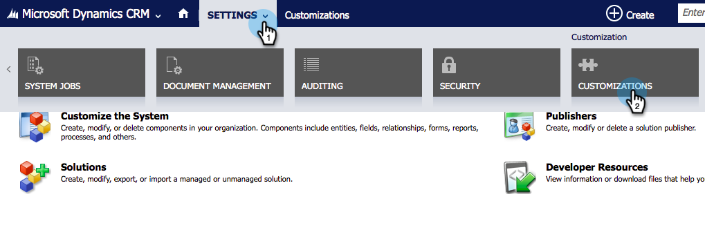
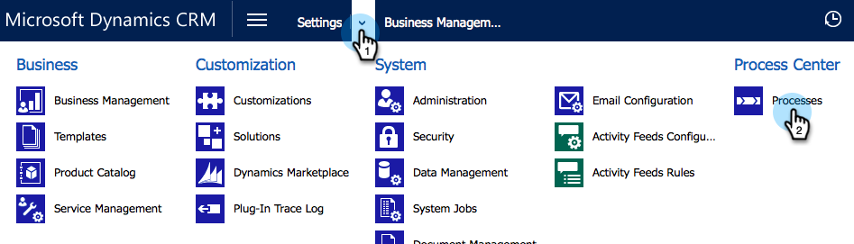
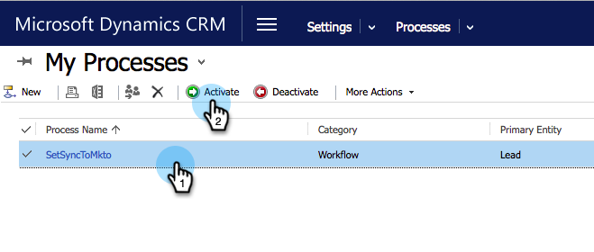

# Creare un filtro di sincronizzazione di Dynamics personalizzato {#create-a-custom-dynamics-sync-filter}

Non vuoi sincronizzare tutti gli elementi di Dynamics CRM in Marketo? Non ti preoccupare! Marketo consente di impostare un filtro di sincronizzazione e sincronizzare solo una parte dei record.

## Panoramica {#overview}

Per impostare un filtro di sincronizzazione Dynamics:

1. Crea un campo personalizzato Due opzioni (booleano) denominato new_synctomkto in Dynamics CRM per qualsiasi oggetto (lead, contatti, account, opportunità e altre entità personalizzate).
1. Assegnare il campo a un valore Sì/No oppure lasciarlo vuoto.

>[!NOTE]
>
>Devi apportare queste modifiche in Dynamics CRM, non nel database o in Marketo.

Marketo cerca questo campo durante la sincronizzazione automatica in background e determina su quali record sincronizzare in base a questa logica:

| Valore campo | Sincronizzazione con Marketo? |
|---|---|
| Il campo non esiste | Sì |
| Campo vuoto | Sì |
| Il campo ha il valore Sì | Sì |
| Campo con valore No | No |

>[!CAUTION]
>
>L&#39;unico modo per dire a Marketo di saltare un record è impostare esplicitamente il valore del campo su **No**. Marketo continua a sincronizzare i record anche se i valori dei campi sono vuoti.

>[!PREREQUISITES]
>
>Installa la versione più recente del plug-in Marketo (3.0.0.1 o successivo). Vai a Marketo > Amministratore > Microsoft Dynamics > Scarica soluzione Marketo.

## Crea campo SyncToMkto {#create-synctomkto-field}

1. Accedi a Dynamics CRM. Fai clic su **Impostazioni**, quindi fai clic su **Personalizzazioni**.

   

1. Fare clic su **Personalizza il sistema**.

   

1. Fai clic su  accanto a **Entità**.

   

1. Fai clic su  accanto a **Lead** e seleziona **Campi**. Quindi fai clic su **Nuovo**.

   

1. Immetti **SyncToMkto** nel campo **Nome visualizzato** e seleziona **Due opzioni** come **Tipo di dati**. Quindi fai clic su **Salva e chiudi**.

   

   >[!NOTE]
   >
   >Scegli un nome visualizzato qualsiasi per questo campo, ma il campo Nome deve essere esattamente **new_synctomkto**. È necessario utilizzare **new** come prefisso predefinito. Se hai modificato il valore predefinito, vai qui a [reimpostare il prefisso predefinito per i nomi dei campi personalizzati](/help/marketo/product-docs/crm-sync/microsoft-dynamics-sync/create-a-custom-dynamics-sync-filter/set-a-default-custom-field-prefix.md). È possibile modificarlo nuovamente dopo aver creato i nuovi campi.

   >[!NOTE]
   >
   >Se si dispone di un flusso di lavoro asincrono impostato, il record ottiene il valore predefinito SyncToMkto configurato nel campo e ottiene il valore corretto qualche secondo dopo al termine dell&#39;esecuzione del flusso di lavoro. Se il valore predefinito è impostato su Sì, tali record verranno creati in Marketo e quindi diventano obsoleti. Usa **No** come valore predefinito per evitare questo problema.

1. Ripeti questo processo e crea il campo **SyncToMkto** per tutte le altre entità su cui desideri limitare la sincronizzazione, ad esempio contatti, account, opportunità ed entità personalizzate.

## Selezionare il filtro in Marketo {#select-the-filter-in-marketo}

Anche se hai già eseguito la sincronizzazione iniziale, accedi e seleziona i campi da sincronizzare con Marketo.

1. Vai su Amministratore e seleziona **MITcrosoft Dynamics**.

   

1. Fare clic su **Modifica** in Dettagli sincronizzazione campi.

   

1. Scorri verso il basso fino al campo e controllalo. Il nome effettivo deve essere new_synctomkto ma il nome visualizzato può essere qualsiasi cosa. Fare clic su **Salva**.

   

Ottimo, ora hai abilitato il filtro di sincronizzazione per Marketo.

## Crea un flusso di lavoro Dynamics per assegnare automaticamente i valori dei filtri di sincronizzazione {#create-a-dynamics-workflow-to-assign-sync-filter-values-automatically}

Puoi sempre assegnare manualmente un valore ai campi SyncToMkto per i record. Ma perché non sfruttare la potenza di un flusso di lavoro Dynamics e assegnare automaticamente un valore al campo SyncToMkto quando viene creato o aggiornato un record?

>[!NOTE]
>
>Non è possibile eseguire questa operazione a livello di database. Deve essere eseguito manualmente nel sistema di gestione delle relazioni con i clienti o utilizzando un flusso di lavoro.
>
>Un flusso di lavoro di Dynamics funziona solo sui nuovi record creati in futuro, non sui dati storici. Utilizzare un aggiornamento batch per spostare i record esistenti.

1. Vai a Dynamics CRM. Fai clic su **Impostazioni**, quindi fai clic su **Processi**.

   

1. Fare clic su **Nuovo**.

   

1. Immetti un nome per il flusso di lavoro e seleziona **Flusso di lavoro** come categoria e **Lead** come entità. Quindi fare clic su **OK**.

   

1. Crea regole per assegnare un valore vero o falso al campo **SyncToMkto** in base alle preferenze della tua organizzazione. Fare clic su **Salva e chiudi**.

   

   >[!NOTE]
   >
   >Definire un&#39;azione predefinita dopo aver fatto clic su **Aggiungi passaggio** per aggiungere una condizione di controllo. Questo imposta i record che non si desidera sincronizzare su **No**. In caso contrario, verranno sincronizzati.

1. Seleziona il flusso di lavoro e fai clic su **Attiva**.

   

   >[!TIP]
   >
   >Consulta [Regole filtro di sincronizzazione personalizzata per un indirizzo e-mail](/help/marketo/product-docs/crm-sync/microsoft-dynamics-sync/create-a-custom-dynamics-sync-filter/custom-sync-filter-rules-for-an-email-address.md) per impostare regole per sincronizzare solo i record per le persone con indirizzi e-mail.

## Dettagli filtro sincronizzazione {#sync-filter-details}

Di seguito sono riportati alcuni dettagli di implementazione che ritenevi dovessero essere noti:

1. Avvia un&#39;operazione di sincronizzazione

   Quando il valore **SyncToMkto** cambia da **No** a **Sì**, Dynamics notifica immediatamente Marketo per avviare la sincronizzazione di questo record. Se il record esiste già, Marketo lo aggiorna. In caso contrario, Marketo crea il record.

   >[!TIP]
   >
   >In questo caso, al registro Marketo viene aggiunta un’operazione `Create [StartSync]`.

1. Interrompere un&#39;operazione di sincronizzazione

   Quando un record modifica il valore SyncToMkto da Sì a No, Marketo riceve una notifica per interrompere la sincronizzazione del record. Tuttavia, il record non viene eliminato, smette invece di ricevere aggiornamenti e diventa obsoleto.

>[!MORELIKETHIS]
>
>* [Filtro di sincronizzazione Microsoft Dynamics: Qualifica](/help/marketo/product-docs/crm-sync/microsoft-dynamics-sync/create-a-custom-dynamics-sync-filter/microsoft-dynamics-sync-filter-qualify.md)
>* [Filtro di sincronizzazione Microsoft Dynamics: Unisci](/help/marketo/product-docs/crm-sync/microsoft-dynamics-sync/create-a-custom-dynamics-sync-filter/microsoft-dynamics-sync-filter-merge.md)
>* [Regole filtro di sincronizzazione personalizzate per un indirizzo e-mail](/help/marketo/product-docs/crm-sync/microsoft-dynamics-sync/create-a-custom-dynamics-sync-filter/custom-sync-filter-rules-for-an-email-address.md)

