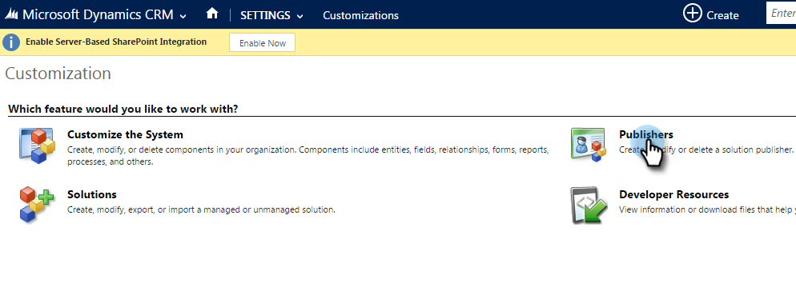

# Impostare un prefisso di campo personalizzato predefinito {#set-a-default-custom-field-prefix}

Il prefisso [!DNL Microsoft Dynamics] predefinito per i campi personalizzati deve essere **new** per consentire la corretta sincronizzazione dei campi proprietari di Marketo. Per modificare il prefisso predefinito, procedere come segue.

1. Vai a [!UICONTROL Settings] e seleziona **[!UICONTROL Customizations].**

   

1. Fai clic su **[!UICONTROL Publishers]**.

   

1. Selezionare l&#39;autore predefinito dall&#39;elenco.

   

1. Cambia il prefisso in **nuovo**. Fai clic su **[!UICONTROL Save and Close]**.

   

1. Vai a [!UICONTROL Settings] > [!UICONTROL Solutions] per pubblicare le personalizzazioni.

   

1. Fai clic su **[!UICONTROL Publish All Customizations]**.

   

1. Ora crea i campi personalizzati. Dopo averli completati, ripristina il prefisso originale.
