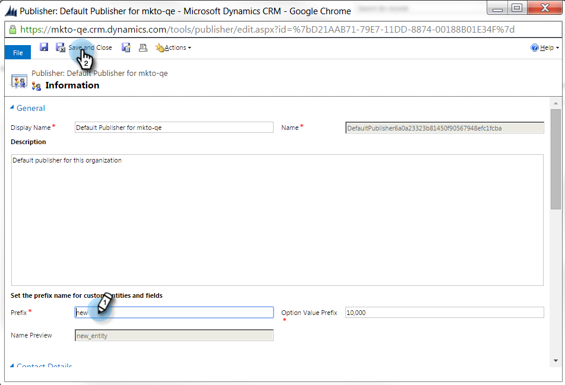
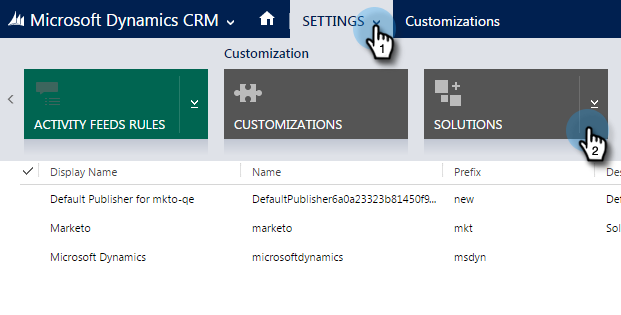

# Imposta un prefisso di campo personalizzato predefinito {#set-a-default-custom-field-prefix}

Il prefisso predefinito di Microsoft Dynamics per i campi personalizzati deve essere _new_ per consentire la corretta sincronizzazione dei campi proprietari di Marketo. Per modificare il prefisso predefinito, procedere come segue.

1. Vai a Impostazioni e seleziona **Personalizzazioni**.

   

1. Fai clic su **Editori**.

   

1. Selezionare l&#39;autore predefinito dall&#39;elenco.

   

1. Cambia il prefisso in **nuovo**. Fare clic su **Salva e chiudi**.

   

1. Vai a Impostazioni > Soluzioni per pubblicare le personalizzazioni.

   

1. Fare clic su **Publish tutte le personalizzazioni**.

   

1. Ora crea i campi personalizzati. Dopo averli completati, ripristina il prefisso originale.
