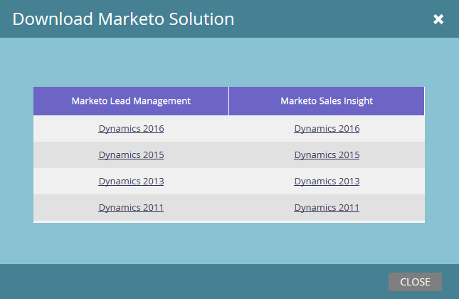

# Rilasci plug-in Marketo per Microsoft Dynamics {#marketo-plugin-releases-for-microsoft-dynamics}

La prima volta che effettuate la sincronizzazione con Microsoft Dynamics, scaricate la versione più recente dei plug-in per Marketo. Marketo aggiorna periodicamente questi plug-in, in modo da poter tornare nella stessa posizione in cui scaricare la nuova versione.

[Scarica l&#39;ultimo plug](sync-setup/download-the-marketo-lead-management-solution.md) corrispondente alla versione di Dynamics.

Nella tabella seguente sono visualizzate le versioni più recenti.

>[!NOTE]
>
>Queste versioni funzionano sia per le versioni locale che online di Dynamics.

<table> 
 <tbody> 
  <tr> 
   <th colspan="1">Versione</th> 
   <th colspan="1">Data di rilascio</th> 
   <th>Note</th> 
  </tr> 
  <tr> 
   <td colspan="1">4.0.0.24</td> 
   <td colspan="1">8/22/18</td> 
   <td colspan="1">È stato aggiunto il supporto per il processo "fuori-box Qualified Lead to contact" per Microsoft Dynamics versione 9.x.</td> 
  </tr> 
  <tr> 
   <td colspan="1">4.0.0.23</td> 
   <td colspan="1">6/27/18</td> 
   <td colspan="1">Correzione dei bug: Errore del processo aziendale durante il tentativo di installare le soluzioni Marketo per Dynamics 2013.</td> 
  </tr> 
  <tr> 
   <td colspan="1">4.0.0.22</td> 
   <td colspan="1">9/29/17</td> 
   <td colspan="1">Correzione dei bug: Revisione interna.</td> 
  </tr> 
  <tr> 
   <td colspan="1">
4.0.0.21
</td> 
   <td colspan="1">11/9/16</td> 
   <td colspan="1">Correzione dei bug: Il plug-in non ha effettuato la sottoscrizione a eventi che acquisiscono la modifica dello stato dell'oggetto personalizzato. Questa correzione è specifica per Dynamics CRM Premise 2011. </td> 
  </tr> 
  <tr> 
   <td colspan="1">4.0.0.20</td> 
   <td colspan="1">7/22/16</td> 
   <td colspan="1">Correzione dei bug: Gli aggiornamenti del ruolo di contatto delle opportunità non venivano catturati completamente.</td> 
  </tr> 
  <tr> 
   <td colspan="1">4.0.0.19</td> 
   <td colspan="1">6/28/16</td> 
   <td colspan="1">
Correzione dei bug: Una transazione di aggiornamento non necessaria sul ruolo opportunità cliente nel registro marketing è stata rilevata al momento della creazione dell'opportunità. 

Correzione dei bug: Una transazione di eliminazione aggiuntiva è stata registrata quando si eliminava l'entità del ruolo opportunità cliente.
</td> 
  </tr> 
  <tr> 
   <td colspan="1">4.0.0.18</td> 
   <td colspan="1">5/31/16</td> 
   <td colspan="1">Correzione dei bug:  L'aggiornamento e l'eliminazione degli oggetti personalizzati sono stati resi asincrono.</td> 
  </tr> 
  <tr> 
   <td colspan="1">4.0.0.17</td> 
   <td colspan="1">4/8/16</td> 
   <td colspan="1">Correzione dei bug: Quando il lead aveva un filtro di sincronizzazione impostato su NO e l’opportunità e il contatto non disponevano di un filtro di sincronizzazione, il comando Crea registro non veniva generato per il contatto e l’opportunità quando il lead era qualificato.</td> 
  </tr> 
  <tr> 
   <td colspan="1">4.0.0.16</td> 
   <td colspan="1">3/29/16</td> 
   <td>Correzione dei bug: Un evento Assign è stato registrato quando il filtro di sincronizzazione è stato disattivato.</td> 
  </tr> 
  <tr> 
   <td colspan="1">4.0.0.15</td> 
   <td colspan="1">3/3/16</td> 
   <td colspan="1">Correzione dei bug: Il cliente non è riuscito a creare un lead in CRM perché l'utente con accesso non aveva l'autorizzazione Configurazione Marketo.</td> 
  </tr> 
  <tr> 
   <td colspan="1">4.0.0.14</td> 
   <td colspan="1">1/18/16</td> 
   <td colspan="1">Correzione dei bug: Sono stati creati limiti di accesso per gli utenti Dynamics normali per risolvere problemi di sicurezza.</td> 
  </tr> 
  <tr> 
   <td colspan="1">4.0.0.13</td> 
   <td colspan="1">12/30/15</td> 
   <td>Correzione dei bug: Gli aggiornamenti in Dynamics non venivano sincronizzati con Marketo per passaggi e immagini.</td> 
  </tr> 
  <tr> 
   <td colspan="1">4.0.0.12</td> 
   <td colspan="1">11/12/15</td> 
   <td colspan="1">Correzione dei bug: I record lead si sincronizzavano con Marketo quando il filtro di sincronizzazione era impostato su false.</td> 
  </tr> 
 </tbody> 
</table>

>[!MORELIKETHIS]
>
>* [Scaricate la soluzione di gestione dei lead Marketo](sync-setup/download-the-marketo-lead-management-solution.md)

