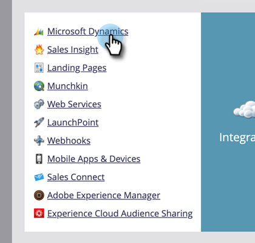

# Abilitare la sincronizzazione della campagna {#enable-campaign-sync}

Questa opzione consente a Marketo di aggiungere e rimuovere membri dalla campagna [!DNL MS Dynamics].

>[!PREREQUISITES]
>
>Aggiornamento alla versione più recente del plug-in [!DNL Dynamics] per Marketo.

>[!NOTE]
>
>**Autorizzazioni amministratore richieste**

1. In **[!UICONTROL My Marketo]**, fai clic su **[!UICONTROL Admin]**.

   

1. Fai clic su **[!UICONTROL Microsoft Dynamics]**.

   

1. In **[!UICONTROL Sync Options]**, fare clic su **[!UICONTROL Edit]**.

   

1. Selezionare la casella di controllo **[!UICONTROL Enable Microsoft Dynamics Campaign Sync]** e fare clic su **[!UICONTROL Save]**.

   

Eccola qui. Dare alla sincronizzazione un po&#39; di tempo per estrarre i dati da [!DNL Microsoft Dynamics] e si è pronti a partire.

>[!NOTE]
>
>Se si reimposta la casella di controllo Sincronizzazione campagna [!DNL Dynamics], verranno aggiornati tutti i dati della campagna precedentemente sincronizzati e le associazioni con gli elenchi di marketing in [!DNL Dynamics].
