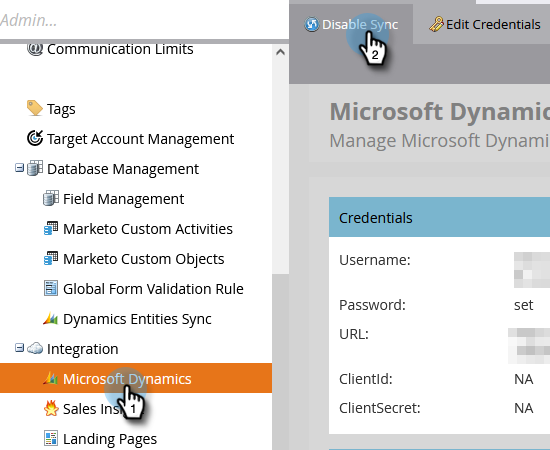

# Abilitare la sincronizzazione per un&#39;entità personalizzata {#enable-sync-for-a-custom-entity}

Se hai bisogno che i dati di entità personalizzati di Dynamics siano disponibili in Marketo Engage, ecco come abilitare la sincronizzazione per esso. **Sono richieste le autorizzazioni di amministratore**.

>[!PREREQUISITES]
>
>Per utilizzare un oggetto personalizzato, è necessario associarlo a un oggetto [lead](/help/marketo/product-docs/crm-sync/microsoft-dynamics-sync/microsoft-dynamics-sync-details/microsoft-dynamics-sync-lead-sync.md){target="_blank"}, [contact](/help/marketo/product-docs/crm-sync/microsoft-dynamics-sync/microsoft-dynamics-sync-details/microsoft-dynamics-sync-contact-sync.md){target="_blank"} o [account](/help/marketo/product-docs/crm-sync/microsoft-dynamics-sync/microsoft-dynamics-sync-details/microsoft-dynamics-sync-account-sync.md){target="_blank"} in Microsoft Dynamics.

>[!NOTE]
>
>* Quando abiliti la sincronizzazione per un’entità personalizzata, Marketo esegue una sincronizzazione iniziale per inserire tutti i dati per l’oggetto personalizzato.
>* Al momento, i membri dell&#39;elenco di marketing e dell&#39;elenco di marketing sono _non supportati_.

>[!IMPORTANT]
>
>L&#39;utente di Marketo Sync ha bisogno dell&#39;accesso in lettura all&#39;oggetto personalizzato per elencarlo ed eseguire una sincronizzazione.

1. Vai alla sezione **[!UICONTROL Amministratore]**.

   

1. Seleziona **[!UICONTROL Microsoft Dynamics]** e fai clic su **[!UICONTROL Disattiva sincronizzazione]**.

   

   >[!NOTE]
   >
   >È necessario disattivare temporaneamente la sincronizzazione globale per abilitare o disabilitare un&#39;entità personalizzata.

1. In Gestione database fare clic su **[!UICONTROL Sincronizzazione entità Dynamics]**.

   

1. Fare clic su **[!UICONTROL Sincronizza schema]**.

   

1. Selezionare l&#39;entità da sincronizzare e fare clic su **[!UICONTROL Abilita sincronizzazione]**.

   

1. Selezionare i campi da sincronizzare o utilizzare come [vincoli](/help/marketo/product-docs/core-marketo-concepts/smart-lists-and-static-lists/using-smart-lists/add-a-constraint-to-a-smart-list-filter.md){target="_blank"} e/o trigger (per i record aggiunti, _non_ aggiornati) negli elenchi smart. Al termine, fare clic su **[!UICONTROL Abilita sincronizzazione]**.

   

   >[!NOTE]
   >
   >Durante il processo di sincronizzazione, potresti notare che l&#39;elemento &quot;[!UICONTROL Sincronizzazione entità dinamiche]&quot; scompare dalla struttura di navigazione. Si tratta di un comportamento previsto che verrà visualizzato nuovamente al termine della sincronizzazione.

1. L’entità ora dispone di un segno di spunta verde.

   

1. Non dimenticare di riattivare la sincronizzazione globale.

   

   >[!NOTE]
   >
   >* Marketo supporta solo entità personalizzate collegate a entità standard profonde uno o due livelli.
   >
   >* La struttura ad oggetti personalizzata può mostrare lo stesso oggetto più di una volta, a causa delle sue connessioni dirette con uno degli oggetti principali (ad esempio lead, contatti o account o connessioni indirette attraverso un oggetto intermedio). In questi casi, scegliere l&#39;oggetto più vicino all&#39;oggetto principale e sceglierne solo uno. La scelta dello stesso oggetto più volte può ostacolare la sincronizzazione dell&#39;oggetto personalizzato.
