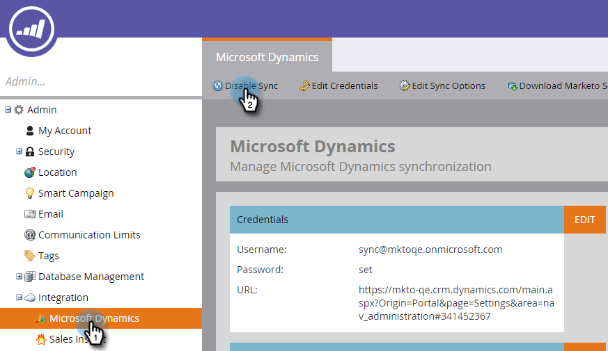

# Sincronizzazione Microsoft Dynamics: Sincronizzazione entità personalizzata {#microsoft-dynamics-sync-custom-entity-sync}

Se devi abilitare la sincronizzazione iniziale delle entità personalizzate per rendere disponibili i dati da Dynamics in Marketo, ecco come farlo.

>[!NOTE]
>
>**Autorizzazioni amministratore richieste**

>[!PREREQUISITES]
>
>Per utilizzare un oggetto personalizzato, deve essere associato a un oggetto [lead](/help/marketo/product-docs/crm-sync/microsoft-dynamics-sync/microsoft-dynamics-sync-details/microsoft-dynamics-sync-lead-sync.md), [contact](/help/marketo/product-docs/crm-sync/microsoft-dynamics-sync/microsoft-dynamics-sync-details/microsoft-dynamics-sync-contact-sync.md) o [account](/help/marketo/product-docs/crm-sync/microsoft-dynamics-sync/microsoft-dynamics-sync-details/microsoft-dynamics-sync-account-sync.md)in Dynamics.

>[!CAUTION]
>
>Assicurati che la sincronizzazione iniziale sia completata (riceverai una notifica via e-mail) prima di iniziare la sincronizzazione per le entità personalizzate.

1. Vai alla sezione Amministratore .

   

1. Fai clic su **Disattiva sincronizzazione** per disattivare temporaneamente la sincronizzazione globale standard.

   

1. Installa una versione di Microsoft Dynamics che supporta la sincronizzazione di entità personalizzata (dopo 2_0_0_2). Consulta [Rilasci plug-in Marketo per MIcrosoft Dynamics](/help/marketo/product-docs/crm-sync/microsoft-dynamics-sync/marketo-plugin-releases-for-microsoft-dynamics.md).

1. Consentire all&#39;utente di sincronizzazione Marketo di accedere in lettura a tutte le entità che intendi sincronizzare.

1. In Gestione database fare clic sul collegamento **Sincronizzazione entità Dynamics**.

   

1. Fai clic sul collegamento **Sincronizza schema** per visualizzare l&#39;elenco delle entità personalizzate disponibili.

   

1. Dopo la sincronizzazione dell’elenco, seleziona i campi da sincronizzare e quelli che desideri utilizzare come [vincoli](/help/marketo/product-docs/core-marketo-concepts/smart-lists-and-static-lists/using-smart-lists/add-a-constraint-to-a-smart-list-filter.md) e/o attivatori negli elenchi avanzati. Al termine, fai clic su **Abilita sincronizzazione**.

   

1. Riattiva la sincronizzazione globale.

   

   >[!NOTE]
   >
   >Marketo supporta solo entità personalizzate collegate a entità standard con uno o due livelli di profondità.

   >[!NOTE]
   >
   >I nomi di entità possono contenere un massimo di **33 caratteri**.

Sei buono!
