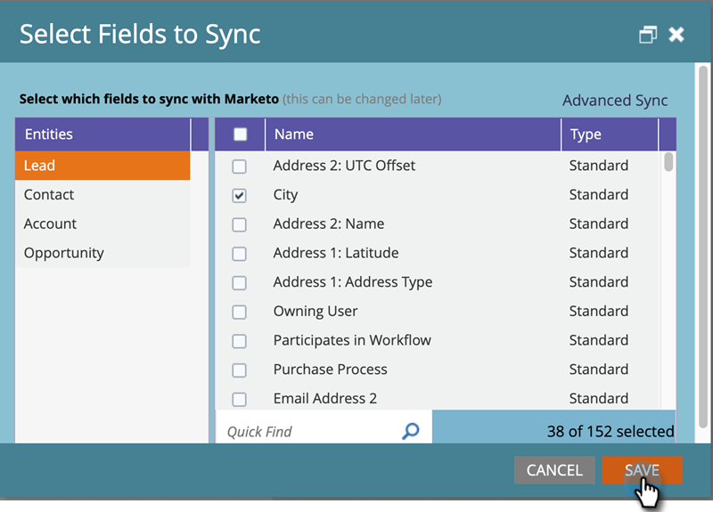

# Modifica dei campi da sincronizzare prima di eliminarli in [!DNL Dynamics] {#editing-fields-to-sync-before-deleting-them-in-dynamics}

A volte può essere utile eliminare i campi in [!DNL Dynamics]. Marketo mantiene l’elenco dei campi come riferimento su cui basare la sincronizzazione. Se un campo viene eliminato in [!DNL Dynamics] mentre la sincronizzazione è attiva, potrebbero verificarsi errori di sincronizzazione. Prima di eliminare un campo, effettua le seguenti operazioni.

1. In Marketo, fare clic su **[!UICONTROL Admin]**.

   

1. In [!UICONTROL Integration], fare clic su **[!UICONTROL Microsoft Dynamics]**.

   

1. Fai clic su **[!UICONTROL Disable Sync]**.

   

1. In una nuova scheda del browser, accedi a [!DNL Dynamics] ed elimina i campi desiderati.

1. In Marketo, in [!DNL Microsoft Dynamics], fare clic su **[!UICONTROL Edit]** accanto a &quot;[!UICONTROL Step 2: Select Fields to Sync]&quot;.

   

1. Rivedere i campi e fare clic su **[!UICONTROL Save]**.

   

>[!CAUTION]
>
>È necessario fare clic su **[!UICONTROL Save]** per salvare lo schema aggiornato per la sincronizzazione, anche se non sono state apportate modifiche.

>[!NOTE]
>
>Se la sincronizzazione non viene interrotta prima di eliminare un campo in [!DNL Dynamics], potrebbero verificarsi errori. In caso contrario, la sincronizzazione verrà interrotta. Prima di riprendere, l&#39;amministratore di Marketo deve rivedere &quot;[!UICONTROL Select Fields to Sync]&quot; (discusso in precedenza) e fare clic su **[!UICONTROL Save]** per consentire alla sincronizzazione di accettare le modifiche allo schema.

Ricordati di abilitare la sincronizzazione dopo il salvataggio delle modifiche.
