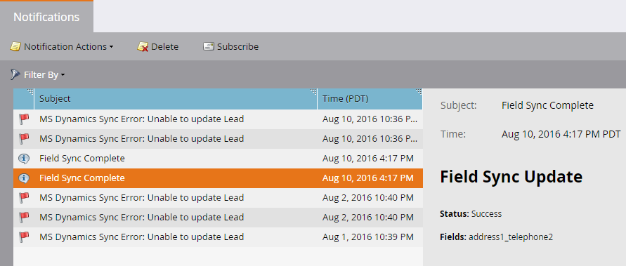
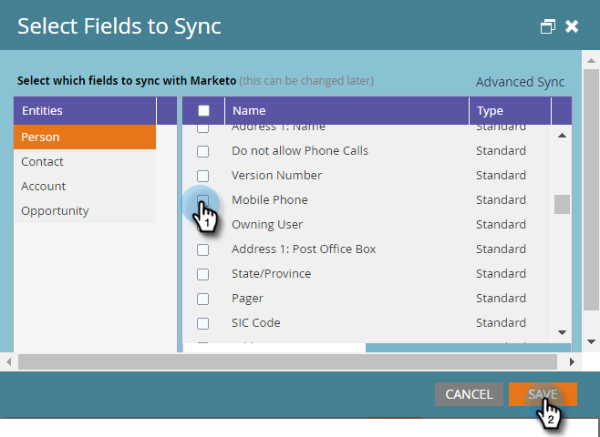

# Utilizzare la sincronizzazione rapida con Microsoft Dynamics per un nuovo campo personalizzato {#use-quick-sync-with-microsoft-dynamics-for-a-new-custom-field}

Il marketing o le vendite vogliono un nuovo campo. Oppure, forse ne hai dimenticato uno nella selezione iniziale del campo. O le tue esigenze sono cambiate. In ogni caso, è possibile utilizzare Sincronizzazione rapida per risincronizzare campi specifici.

Normalmente, utilizzerai Sincronizzazione rapida per aggiungere un nuovo campo e far aggiornare i valori. Tuttavia, in alcuni casi potrebbe essere utile sincronizzare un campo esistente. Puoi limitare la sincronizzazione dei campi in base a un intervallo di date aggiornato o creato. Vedi [Opzioni di sincronizzazione avanzate](#Advanced_Sync_Options) qui sotto per i dettagli.

Quick Sync può sincronizzare valori nulli. Ad esempio, se utilizzi i valori A e B e modifichi un valore B in Dynamics su null, il valore null verrà sincronizzato in Marketo.

## Sincronizzazione rapida per tutti i record {#quick-sync-for-all-records}

Ecco come utilizzare la sincronizzazione rapida per eseguire la risincronizzazione per i nuovi campi.

1. In Marketo, fai clic su **Amministratore**.

   

1. Fai clic su **Microsoft Dynamics**.

   

1. In Dettagli sincronizzazione campo fare clic su **Modifica**.

   

1. Seleziona i campi da sincronizzare rapidamente e fai clic su **Salva**.

   

   >[!NOTE]
   >
   >È possibile selezionare campi da più entità.

1. Al termine della sincronizzazione riceverai una notifica.

   

   >[!CAUTION]
   >
   >La sincronizzazione viene eseguita fianco a fianco con altre sincronizzazioni e, a seconda delle dimensioni del database, il completamento può richiedere molto tempo. Quando un campo è in coda per la sincronizzazione, non è possibile deselezionarlo.

## Opzioni di sincronizzazione avanzate {#advanced-sync-options}

Cosa succede se desideri sincronizzare un campo esistente, ma solo per un set limitato di dati? Ecco come.

1. Deseleziona la casella di controllo relativa a un campo esistente. Fai clic su **Salva**.

   

1. Apri nuovamente la finestra a comparsa e seleziona nuovamente il campo.

   

1. Fai clic su **Sincronizzazione avanzata**.

   

1. Scegli **Aggiornato** e seleziona un intervallo di date utilizzando i selettori di date. Fai clic su **Salva**.

   

   Solo i record aggiornati tra il 19/08 e il 19/09/16 saranno sincronizzati rapidamente per il campo.

## Correzione dei campi fuori sincronia {#fixing-out-of-sync-fields}

Nel raro caso in cui un campo Dynamics e Marketo non siano sincronizzati, esiste un modo rapido e semplice per sincronizzarli nuovamente.

1. Deseleziona il campo e fai clic su **Salva**.

   

1. Seleziona nuovamente il campo e fai clic su **Salva**. È tutto!

   

   Dovrebbe ripararlo!
