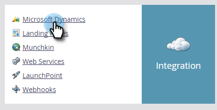

# Usa sincronizzazione rapida con [!DNL Microsoft Dynamics] per un nuovo campo personalizzato {#use-quick-sync-with-microsoft-dynamics-for-a-new-custom-field}

Il reparto Marketing o Vendite richiede un nuovo campo. O forse ne hai dimenticato uno nella selezione iniziale del campo. Oppure, le tue esigenze sono cambiate. In ogni caso, puoi utilizzare la sincronizzazione rapida per risincronizzare campi specifici.

Normalmente si utilizza la sincronizzazione rapida per aggiungere un nuovo campo e aggiornare i valori. Tuttavia, in alcuni casi potrebbe essere utile sincronizzare un campo esistente. Puoi limitare la sincronizzazione dei campi in base a un intervallo di date aggiornato o creato. Per ulteriori dettagli, consulta [Opzioni di sincronizzazione avanzate](#Advanced_Sync_Options) di seguito.

La sincronizzazione rapida può sincronizzare valori Null. Se ad esempio si utilizzano i valori A e B e si modifica un valore B in [!DNL Dynamics] in null, il valore null verrà sincronizzato con Marketo.

## Sincronizzazione rapida per tutti i record {#quick-sync-for-all-records}

Utilizzare la sincronizzazione rapida per risincronizzare i nuovi campi.

1. In Marketo, fare clic su **[!UICONTROL Admin]**.

   

1. Fai clic su **[!UICONTROL Microsoft Dynamics]**.

   

1. In [!UICONTROL Field Sync Details], fare clic su **[!UICONTROL Edit]**.

   

1. Selezionare i campi da sincronizzare rapidamente e fare clic su **[!UICONTROL Save]**.

   

   >[!NOTE]
   >
   >È possibile selezionare campi da più entità.

1. Riceverai una notifica al termine della sincronizzazione.

   

   >[!CAUTION]
   >
   >La sincronizzazione viene eseguita affiancata ad altre sincronizzazioni e, a seconda delle dimensioni del database, può richiedere molto tempo. Quando un campo si trova in una coda per la sincronizzazione, non è possibile deselezionarlo.

## Opzioni di sincronizzazione avanzate {#advanced-sync-options}

Cosa succede se desideri sincronizzare un campo esistente, ma solo per un set limitato di dati? Ecco come.

1. Deselezionare la casella di controllo per un campo esistente. Fai clic su **[!UICONTROL Save]**.

   

1. Apri nuovamente la finestra a comparsa e riseleziona il campo.

   

1. Fai clic su **[!UICONTROL Advanced Sync]**.

   

1. Scegli **[!UICONTROL Updated]** e seleziona un intervallo di date utilizzando i selettori di date. Fai clic su **[!UICONTROL Save]**.

   

   Solo i record aggiornati tra il 8/19/16 e il 9/19/16 verranno sincronizzati rapidamente per il campo.

## Correzione dei campi non sincronizzati {#fixing-out-of-sync-fields}

Nel raro caso in cui un campo [!DNL Dynamics] e Marketo non siano sincronizzati, è possibile eseguirne la risincronizzazione in modo rapido e semplice.

1. Deselezionare il campo e fare clic su **[!UICONTROL Save]**.

   

1. Selezionare nuovamente il campo e fare clic su **[!UICONTROL Save]**.

   

   Questo dovrebbe aggiustarlo!
