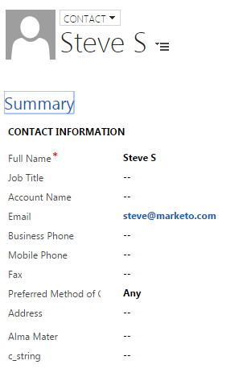

# Crea un contatto in [!DNL Microsoft Dynamics] {#create-a-contact-in-microsoft-dynamics}

1. Seleziona la persona solo Marketo Engage (il tipo di Microsoft è vuoto) che desideri creare come contatto in Dynamics.

   

1. Fare clic su **[!UICONTROL Person Actions]** e **[!DNL Microsoft]** e selezionare **[!UICONTROL Sync Person to Microsoft]**.

   

1. Fare clic su **[!UICONTROL Sync As]** e selezionare **[!UICONTROL Contact]**. Fai clic su **[!UICONTROL Run Now]**.

   

   >[!NOTE]
   >
   >Quando si utilizza l&#39;azione di flusso &quot;[!UICONTROL Sync Person to Microsoft]&quot; (solo in una campagna Trigger), il lead/contatto verrà creato in tempo reale in Dynamics.

1. Marketo qualifica il record Lead in [!DNL Dynamics] come contatto non associato ad alcun account in [!DNL Dynamics].

   

1. È ora possibile selezionare **[!UICONTROL Contact]** quando si utilizza il vincolo Sincronizza con nome in un filtro Smart Campaign.

   
