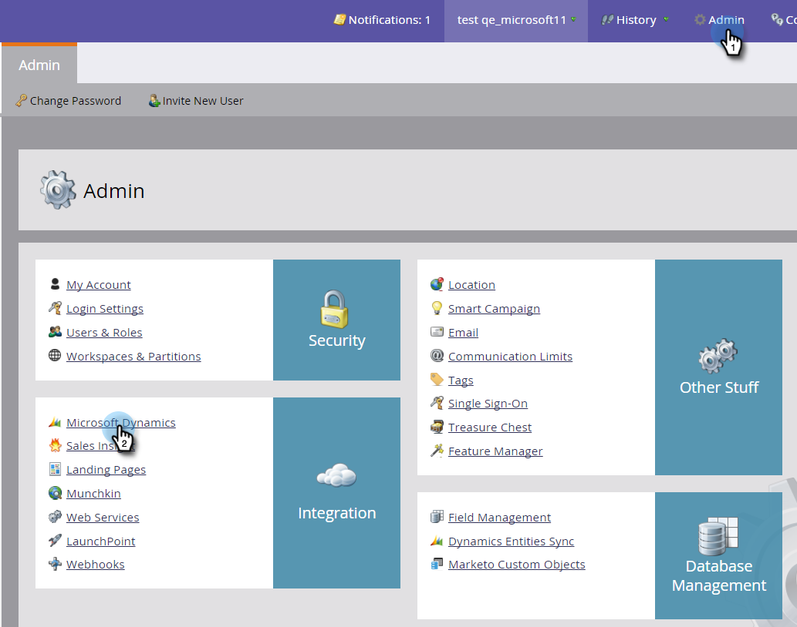

# Stato sincronizzazione {#sync-status}

Nelle schede [!UICONTROL Sync Status] e [!UICONTROL Sync Errors] è possibile mantenere le schede della velocità effettiva corrente e del backlog del processo di sincronizzazione.

## Scheda [!UICONTROL Sync Status] {#sync-status-tab}

1. Fare clic su **[!UICONTROL Admin]** e **[!UICONTROL Microsoft Dynamics]**.

   

1. Fare clic sulla scheda **[!UICONTROL Sync Status]**.

   

   In questa tabella viene visualizzato il backlog di inserimenti e aggiornamenti non ancora sincronizzati per ogni oggetto.

1. Fare doppio clic su una riga per visualizzare le informazioni sull&#39;opportunità.

   

   I dettagli dello stato di sincronizzazione vengono suddivisi per inserti e aggiornamenti e i record di inserimento e aggiornamento meno recenti.

   

1. Fare clic sull&#39;elenco a discesa **[!UICONTROL View]** e selezionare **[!UICONTROL Last Hour]** per visualizzare le informazioni sulla velocità effettiva.

   

   La visualizzazione mostra ora il numero di record sincronizzati nell’ultima ora completa (ad esempio, 1-2 p.m.).

   

   >[!NOTE]
   >
   >Quando si visualizza la visualizzazione [!UICONTROL Last Hour], le colonne [!UICONTROL Inserts] e [!UICONTROL Updates] mostrano N/D. Questo è il comportamento previsto.

## Scheda [!UICONTROL Sync Errors] {#sync-errors-tab}

Sfogliare, cercare o esportare i lead (e altri oggetti) che non sono stati sincronizzati con dettagli quali operazione, direzione, codice di errore e messaggio di errore.

>[!MORELIKETHIS]
>
>[Tipi di notifica](/help/marketo/product-docs/core-marketo-concepts/miscellaneous/understanding-notifications/notification-types.md){target="_blank"}
