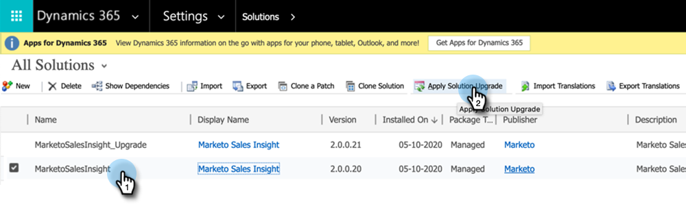

# Versioni dei plug-in per Microsoft Dynamics MSI {#plug-in-releases-for-microsoft-dynamics-msi}

La prima volta che esegui la sincronizzazione con Microsoft Dynamics, scarichi e installi la versione più recente dei plug-in per Marketo Sales Insight (MSI). Periodicamente, Marketo aggiorna questi plug-in, in modo da poter tornare nella stessa posizione per scaricare la nuova versione.

Se utilizzi la soluzione di sincronizzazione CRM nativa di Marketo per Dynamics, [scarica il plug-in più recente](/help/marketo/product-docs/marketo-sales-insight/msi-for-microsoft-dynamics/installing/download-the-marketo-sales-insight-solution-for-microsoft-dynamics.md){target="_blank"} corresponding to your Dynamics release. For those who have a custom sync and have purchased Marketo Sales Insight, the [package is here](https://mktg-cdn.marketo.com/community/MarketoSalesInsight_NonNative.zip){target="_blank"}.

>[!NOTE]
>
>Queste versioni funzionano sia per le versioni on-premise che per quelle online di Dynamics.

## Aggiornamento della soluzione MSI {#upgrading-your-msi-solution}

1. Importa la versione più recente della soluzione _sulla versione esistente_ di Dynamics CRM premendo il tasto **Importa** in Dynamics.

   

>[!NOTE]
>
>Esempio: se la versione di Dynamics CRM è 2.0.0.20 e la versione più recente è 2.0.0.21, puoi importare _oltre_ versione 2.0.0.20.

1. Clic **Successivo**.

   

1. Seleziona **Fase di aggiornamento** e **Gestisci personalizzazioni**, quindi fai clic su **Importa**.

   

1. Clic **Successivo**.

   

1. Dopo un’importazione corretta, vedrai due soluzioni MSI: MarketoSalesInsight e MarketoSalesInsight_Upgrade. Seleziona la soluzione precedente e fai clic su Applica aggiornamento soluzione.

   

Ed è tutto! Dopo l’aggiornamento verrà visualizzata una sola soluzione MSI.

## Aggiornamenti delle versioni {#version-updates}

<table> 
 <colgroup> 
  <col> 
  <col> 
  <col> 
 </colgroup> 
 <tbody> 
  <tr> 
   <th colspan="1">Data di rilascio</th> 
   <th colspan="1">Versione</th> 
   <th colspan="1">Note</th> 
  </tr> 
  <tr> 
   <td colspan="1">02/03/22</td> 
   <td colspan="1">2.0.0.27</td> 
   <td colspan="1">Layout account per approfondimenti: momenti di interesse, modifiche del punteggio, attività web, attività e-mail</td> 
  </tr>
  <tr> 
   <td colspan="1">01/05/22</td> 
   <td colspan="1">2.0.0.26</td> 
   <td colspan="1">Punteggio adozione programma per invio e-mail</td> 
  </tr>
  <tr> 
   <td colspan="1">10/28/21</td> 
   <td colspan="1">2.0.0.25</td> 
   <td colspan="1">Metriche del punteggio di adozione del prodotto, nuova dashboard globale (attività web, e-mail, elementi di maggiore rilevanza)</td> 
  </tr>
  <tr> 
   <td colspan="1">02/10/21</td> 
   <td colspan="1">2.0.0.22</td> 
   <td colspan="1">Rimuovi il controllo automatico abilitato e le modifiche alla documentazione nella soluzione MSI</td> 
  </tr>
  <tr> 
   <td colspan="1">10/01/20</td> 
   <td colspan="1">2.0.0.21</td> 
   <td colspan="1">Correzione bug: assegnazione dell’accesso ai campi di configurazione API MSI per gli utenti con ruolo Sales Insight</td> 
  </tr> 
  <tr> 
   <td colspan="1">07/20/20</td> 
   <td colspan="1">2.0.0.20</td> 
   <td colspan="1">Correzione bug: aggiungi un messaggio di convalida per i record non sincronizzati</td> 
  </tr> 
  <tr> 
   <td colspan="1">06/12/20</td> 
   <td colspan="1">2.0.0.19</td> 
   <td colspan="1">Correzione bug: per nascondere la password segreta MSI nella configurazione API MSD</td> 
  </tr> 
  <tr> 
   <td colspan="1">05/26/20</td> 
   <td colspan="1">2.0.0.18</td> 
   <td colspan="1">Correzione bug: per modificare la convalida dell'ID ruolo MSI per la visualizzazione dei pulsanti MSI</td> 
  </tr> 
  <tr> 
   <td colspan="1">05/21/20</td> 
   <td colspan="1">2.0.0.17</td> 
   <td colspan="1">Correzione bug: scopri il campo del proprietario e campi non obbligatori</td> 
  </tr> 
  <tr> 
   <td colspan="1">04/28/20</td> 
   <td colspan="1">2.0.0.16</td> 
   <td colspan="1">Correzione bug: rimozione della dipendenza del collegamento per l'impostazione della mappa del sito di CRM MSD</td> 
  </tr> 
 </tbody> 
</table>
