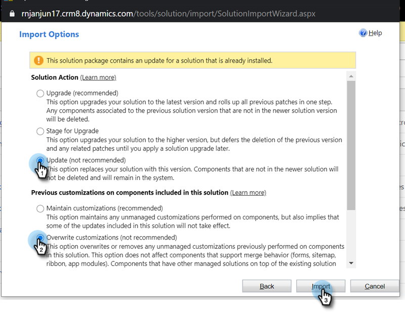

# Rilasci plug-in per Microsoft Dynamics MSI {#plug-in-releases-for-microsoft-dynamics-msi}

La prima volta che effettuate la sincronizzazione con Microsoft Dynamics, scaricate e installate la versione più recente dei plug-in per Marketing Sales Insight (MSI). Marketo aggiorna periodicamente questi plug-in, in modo da poter tornare nella stessa posizione in cui scaricare la nuova versione.

[scarica il plug-in più recente](/help/marketo/product-docs/marketo-sales-insight/msi-for-microsoft-dynamics/installing/download-the-marketo-sales-insight-solution-for-microsoft-dynamics.md) corrispondente alla versione di Dynamics.

>[!NOTE]
>
>Queste versioni funzionano sia per le versioni locale che online di Dynamics.

## Aggiornamento della soluzione MSI {#updating-your-msi-solution}

1. Importa la versione più recente della soluzione sulla versione esistente di Dynamics CRM (ad esempio: se Dynamics CRM dispone della versione 1.4 e la versione più recente è 1.5, importerai _oltre_ versione 1.4).
1. Verrà visualizzato il seguente pop-up. Selezionare le opzioni **Aggiorna** e **Sovrascrivi personalizzazione**, quindi fare clic su **Importa**.

   

## Aggiornamenti delle versioni {#version-updates}

<table> 
 <colgroup> 
  <col> 
  <col> 
  <col> 
 </colgroup> 
 <tbody> 
  <tr> 
   <th colspan="1">Versione</th> 
   <th colspan="1">Data di rilascio</th> 
   <th colspan="1">Note</th> 
  </tr> 
  <tr> 
   <td colspan="1">20/07/20</td> 
   <td colspan="1">2.0.0.20</td> 
   <td colspan="1">Correzione dei bug: Aggiunta di un messaggio di convalida per i record non sincronizzati</td> 
  </tr> 
  <tr> 
   <td colspan="1">12/06/20</td> 
   <td colspan="1">2.0.0.19</td> 
   <td colspan="1">
Correzione dei bug: Per nascondere la password segreta MSI nella configurazione API MSD
</td> 
  </tr> 
  <tr> 
   <td colspan="1">26/05/20</td> 
   <td colspan="1">2.0.0.18</td> 
   <td colspan="1">
Correzione dei bug: Per modificare la convalida ID ruolo MSI per la visualizzazione dei pulsanti MSI
</td> 
  </tr> 
  <tr> 
   <td colspan="1">21/05/20</td> 
   <td colspan="1">2.0.0.17</td> 
   <td colspan="1">
Correzione dei bug: Visualizzare il campo proprietario e rendere i campi non obbligatori
</td> 
  </tr> 
  <tr> 
   <td colspan="1">28/04/20</td> 
   <td colspan="1">4.0.0.16</td> 
   <td colspan="1">
Correzione dei bug: Rimozione della dipendenza del collegamento di impostazione del sitemap MSD CRM
</td> 
  </tr> 
 </tbody> 
</table>
