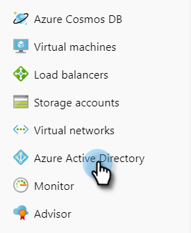
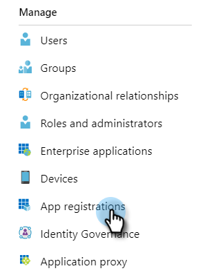

# Registrare un’app con Azure per acquisire l’ID client/ID app {#register-an-app-with-azure-to-acquire-your-client-id-app-id}

Azure Active Directory estende le directory locali nel cloud, fornendo il supporto per il CRM [!DNL MS Dynamics 365] con l&#39;autenticazione ADFS locale.

## Registrazione di una nuova app {#registering-a-new-app}

1. [Accedi](https://login.microsoftonline.com/){target="_blank"} al portale di gestione di Microsoft Azure utilizzando un account con autorizzazioni di amministratore. È inoltre possibile accedere al portale di Microsoft Azure tramite l&#39;Admin Center di Office 365 espandendo l&#39;elemento **[!UICONTROL Admin]** nel riquadro di spostamento a sinistra e selezionando **[!UICONTROL Azure AD]**.

   >[!CAUTION]
   >
   >È necessario utilizzare un account nello stesso abbonamento [!DNL Office 365] di quello con cui si intende registrare l&#39;app.

   >[!NOTE]
   >
   >Se non disponi di un account Azure, puoi [registrarti](https://azure.microsoft.com/en-us/free/){target="_blank"} per un account. Per ulteriori informazioni, consulta la documentazione di Microsoft o rivolgiti al tuo rappresentante Microsoft. Dopo aver creato un account Azure, puoi registrare una o più app seguendo la procedura descritta di seguito.
   >
   >
   >Se disponi di un account Azure ma la sottoscrizione [!DNL Office 365] a [!DNL Microsoft Dynamics 365] non è disponibile nella sottoscrizione Azure, segui [queste istruzioni](https://msdn.microsoft.com/office/office365/howto/setup-development-environment#bk_CreateAzureSubscription){target="_blank"} per associare i due account.

1. Trovare e fare clic su **[!UICONTROL Azure Active Directory]** nel riquadro di spostamento a sinistra.

   

1. In [!UICONTROL Manage], fare clic su **[!UICONTROL App registrations]**.

   

1. Fai clic su **[!UICONTROL New registration]** nella parte superiore della pagina.

   

1. Immetti un nome per l&#39;app, scegli il tipo di account applicabile e immetti un URL di reindirizzamento. Quindi fare clic su **[!UICONTROL Register]** nella parte inferiore della pagina.

   

1. Ora dovresti visualizzare l&#39;app nella scheda **[!UICONTROL App registrations]**.

   

## Configurazione delle autorizzazioni dell’app {#configuring-app-permissions}

1. Nella scheda **[!UICONTROL App registrations]** di Active Directory fare clic sull&#39;app per la quale si desidera configurare le autorizzazioni.

   

1. In [!UICONTROL Manage], fare clic su **[!UICONTROL API permissions]**.

   

1. Fare clic sul pulsante **[!UICONTROL Add a permission]**.

   

1. Scegli **[!UICONTROL Dynamics CRM]**.

   

1. Selezionare la casella **[!UICONTROL Access Common Data Service as organization users]**, quindi fare clic su **[!UICONTROL Add permissions].**

   

1. Una volta aggiunte correttamente le autorizzazioni, attendi almeno 10 secondi.

   

1. Fare clic sul pulsante **[!UICONTROL Grant admin consent]**.

   

1. Fai clic su **[!UICONTROL Yes]** per confermare.

   

   E hai finito!

   
