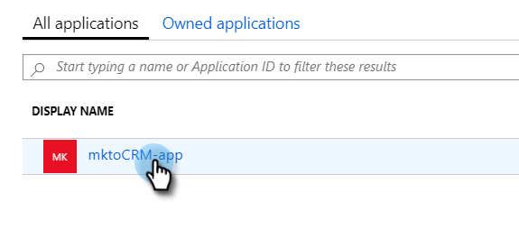

# Registra un’app con Azure per acquisire l’ID client/ID app {#register-an-app-with-azure-to-acquire-your-client-id-app-id}

Azure Active Directory estende le directory locali nel cloud, fornendo supporto per MS Dynamics 365 CRM con autenticazione ADFS on-premise.

## Registrazione di una nuova app {#registering-a-new-app}

1. [Accedi](https://login.microsoftonline.com/){target="_blank"} al portale di gestione di Microsoft Azure utilizzando un account con autorizzazioni di amministratore. È inoltre possibile accedere al portale di Microsoft Azure tramite l&#39;Admin Center di Office 365 espandendo l&#39;elemento **[!UICONTROL Admin]** nel riquadro di spostamento a sinistra e selezionando **[!UICONTROL Azure AD]**.

   >[!CAUTION]
   >
   >Devi utilizzare un account nello stesso abbonamento a Office 365 con cui intendi registrare l’app.

   >[!NOTE]
   >
   >Se non disponi di un account Azure, puoi [iscriverti](https://azure.microsoft.com/en-us/free/){target="_blank"} per un account. Per ulteriori informazioni, consulta la documentazione di Microsoft o rivolgiti al tuo rappresentante Microsoft. Dopo aver creato un account di Azure, è possibile registrare una o più app utilizzando la procedura descritta di seguito.
   >
   >
   >Se disponi di un account di Azure ma la sottoscrizione di Office 365 con Microsoft Dynamics 365 non è disponibile nella sottoscrizione di Azure, segui [queste istruzioni](https://msdn.microsoft.com/office/office365/howto/setup-development-environment#bk_CreateAzureSubscription){target="_blank"} per associare i due account.

1. Individuare e fare clic su **[!UICONTROL Azure Active Directory]** nel riquadro di spostamento a sinistra.

   

1. In Gestisci fare clic su **[!UICONTROL Registrazioni app]**.

   

1. Fai clic su **[!UICONTROL Nuova registrazione]** nella parte superiore della pagina.

   

1. Immetti un nome per l&#39;app, scegli il tipo di account applicabile e immetti un URL di reindirizzamento. Fai clic su **[!UICONTROL Registra]** nella parte inferiore della pagina.

   

1. Ora dovresti visualizzare l&#39;app nella scheda **[!UICONTROL Registrazioni app]**.

   

## Configurazione delle autorizzazioni dell’app {#configuring-app-permissions}

1. Nella scheda **[!UICONTROL Registrazioni app]** in Active Directory, fare clic sull&#39;app per la quale si desidera configurare le autorizzazioni.

   

1. In Gestisci fare clic su **[!UICONTROL Autorizzazioni API]**.

   

1. Fai clic sul pulsante **[!UICONTROL Aggiungi un&#39;autorizzazione]**.

   

1. Scegliere **[!UICONTROL Dynamics CRM]**.

   

1. Seleziona la casella **[!UICONTROL Accedi a Common Data Service come utenti dell&#39;organizzazione]**, quindi fai clic su **[!UICONTROL Aggiungi autorizzazioni]**.

   

1. Una volta aggiunte correttamente le autorizzazioni, attendi almeno 10 secondi.

   

1. Fai clic sul pulsante **[!UICONTROL Concedi il consenso amministratore]**.

   

1. Fai clic su **[!UICONTROL Sì]** per confermare.

   

   E hai finito!

   
