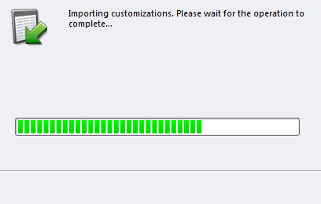

# Passaggio 1 di 3: installare la soluzione Marketo (on-premise 2011) {#step-of-install-the-marketo-solution-on-premises}

Prima di poter sincronizzare Microsoft Dynamics On-Premises e Marketo, è necessario installare la soluzione Marketo in Dynamics.

>[!NOTE]
>
>Dopo aver sincronizzato Marketo con un CRM, non è possibile eseguire una nuova sincronizzazione senza sostituire l&#39;istanza.

>[!PREREQUISITES]
>
>Devi avere [Distribuzione con connessione Internet](https://www.microsoft.com/en-us/download/confirmation.aspx?id=41701) (IFD) [Servizi federativi Active Directory](https://msdn.microsoft.com/en-us/library/bb897402.aspx) 2.0, 2.1 o 3.0 (ADFS) configurati. **Nota**: il documento IFD viene scaricato automaticamente quando fai clic sul collegamento.
>
>[Scarica la soluzione di gestione dei lead Marketo](/help/marketo/product-docs/crm-sync/microsoft-dynamics-sync/sync-setup/download-the-marketo-lead-management-solution.md) prima di iniziare.

>[!NOTE]
>
>**Autorizzazioni di amministrazione di Dynamics richieste.**
>
>Per eseguire questa sincronizzazione sono necessari privilegi di amministratore CRM.

1. Accedi a **Dynamics**, seleziona **Impostazioni** nel menu in basso a sinistra.

   

1. Seleziona **Soluzioni** nell&#39;albero.

   

1. Clic **Importa**.

   

1. Clic **Sfoglia**. Selezionare la soluzione di gestione dei lead Marketo [scaricato](/help/marketo/product-docs/crm-sync/microsoft-dynamics-sync/sync-setup/download-the-marketo-lead-management-solution.md). Clic **Successivo**.

   

1. Visualizzare le informazioni sulla soluzione e fare clic su **Visualizza dettagli pacchetto soluzione**.

   

1. Dopo aver verificato tutti i dettagli, fai clic su **Chiudi**.

   

1. Torna alla pagina Informazioni soluzione, fai clic su **Successivo**.

   

1. Assicurati che la casella di controllo dell’opzione del messaggio SDK sia selezionata. Clic **Successivo**.

   

   >[!TIP]
   >
   >Per completare il processo di installazione, è necessario abilitare i popup nel browser.

1. Ora attendi il completamento dell’importazione. Alzati e fai qualche tratto.

   

1. Fai clic su **Chiudi**.

   >[!NOTE]
   >
   >È possibile che venga visualizzato un messaggio di avviso che indica &quot;Gestione lead Marketo completata con avviso&quot;. Questo è del tutto previsto.

   

1. Marketo Lead Management verrà ora visualizzato nel **Tutte le soluzioni** pagina.

   

1. Seleziona Gestione lead Marketo e fai clic su **Pubblica tutte le personalizzazioni.**

   

Non è stato male, vero? Avanti, continuerò a accompagnarti nel resto.

>[!CAUTION]
>
>Se si disabilita uno dei processi di messaggistica SDK di Marketo, l’installazione non funzionerà più.

>[!MORELIKETHIS]
>
>[Passaggio 2 di 3: configurare l’utente di Marketo Sync in Dynamics (on-premises 2011)](/help/marketo/product-docs/crm-sync/microsoft-dynamics-sync/sync-setup/connecting-to-legacy-versions/step-2-of-3-set-up-2011.md)
