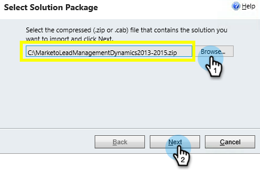

# Passaggio 1 di 3: Installare la soluzione Marketo in Dynamics (On-Premises 2013) {#step-of-install-the-marketo-solution-in-dynamics-on-premises}

Prima di poter sincronizzare Microsoft Dynamics On-Premises e Marketo, è necessario installare la soluzione Marketo in Dynamics.

>[!NOTE]
>
>Dopo aver sincronizzato Marketo con un CRM, non puoi eseguire una nuova sincronizzazione senza sostituire l&#39;istanza.

>[!PREREQUISITES]
>
>Devi avere [Implementazione di Internet Facing](https://www.microsoft.com/en-us/download/confirmation.aspx?id=41701) (IFD) con [Servizi federativi Active Directory](https://msdn.microsoft.com/en-us/library/bb897402.aspx) 2.0, 2.1 o 3.0 (ADFS) configurati. Nota: Il documento IFD viene scaricato automaticamente quando fai clic sul collegamento.
>
>[Scarica la soluzione Marketo](/help/marketo/product-docs/crm-sync/microsoft-dynamics-sync/sync-setup/download-the-marketo-lead-management-solution.md) prima di iniziare.

>[!NOTE]
>
>**Autorizzazioni per l’amministrazione di Dynamics richieste.**
>
>Per eseguire questa sincronizzazione è necessario disporre dei privilegi di amministratore CRM.

1. Accedi a **Dynamics**. Fai clic sul pulsante **Microsoft Dynamics CRM** menu a discesa e seleziona **Impostazioni**.

   

1. Sotto **Impostazioni**, seleziona **Soluzioni**.

   

1. Fai clic su **Importa**.

   

1. Fai clic su **Sfoglia** e seleziona la [soluzione scaricata](/help/marketo/product-docs/crm-sync/microsoft-dynamics-sync/sync-setup/download-the-marketo-lead-management-solution.md). Fai clic su **Successivo**.

   

1. Visualizza le informazioni sulla soluzione e fai clic su **Visualizza i dettagli del pacchetto della soluzione**.

   

1. Dopo aver controllato tutti i dettagli, fai clic su **Chiudi**.

   

1. Nella pagina Informazioni sulla soluzione , fai clic su **Successivo**.

   

1. Assicurati che l&#39;opzione SDK sia selezionata. Fai clic su **Importa**.

   

1. Attendi il completamento dell’importazione.

   >[!TIP]
   >
   >Sarà necessario abilitare i pop-up sul browser per completare il processo di installazione.

   

1. Scarica un file di registro (se lo desideri) e fai clic su **Chiudi**.

   >[!NOTE]
   >
   >È possibile che venga visualizzato un messaggio che indica &quot;Gestione lead Marketo completata con un avviso&quot;. Ciò è pienamente atteso.

   

1. Gestione lead Marketo verrà ora visualizzata nella pagina **Tutte le soluzioni** pagina.

   

1. Seleziona la soluzione Marketo e fai clic su **Pubblica tutte le personalizzazioni**.

   

Non era male giusto? Avanti, continuerò a passarvi attraverso il resto.

>[!CAUTION]
>
>La disattivazione di uno qualsiasi dei processi di messaggistica SDK di Marketo provocherà un&#39;installazione non funzionante.

>[!MORELIKETHIS]
>
>[Passaggio 2 di 3: Configura l’utente di sincronizzazione per Marketo (On-Premises 2013)](/help/marketo/product-docs/crm-sync/microsoft-dynamics-sync/sync-setup/connecting-to-legacy-versions/step-2-of-3-configure-2013.md)
