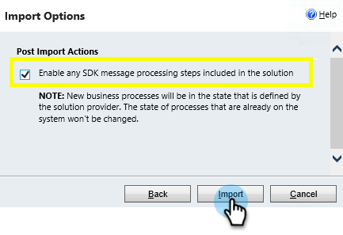
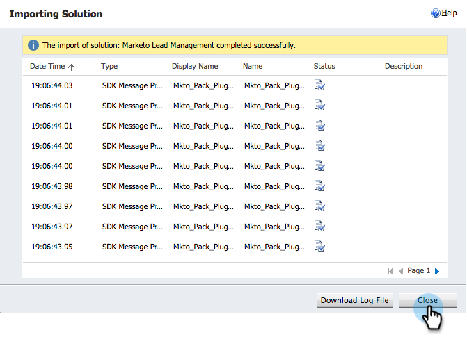

# Passaggio 1 di 3: installare la soluzione Marketo in [!DNL Dynamics] (on-premise 2013) {#step-of-install-the-marketo-solution-in-dynamics-on-premises}

Prima di poter sincronizzare [!DNL Microsoft Dynamics] On-Premises e Marketo, è necessario installare la soluzione Marketo in [!DNL Dynamics].

>[!NOTE]
>
>Dopo aver sincronizzato Marketo con un CRM, non è possibile eseguire una nuova sincronizzazione senza sostituire l&#39;istanza.

>[!PREREQUISITES]
>
>È necessario che sia configurato [Internet Facing Deployment](https://learn.microsoft.com/en-us/dynamics365/customerengagement/on-premises/deploy/configure-an-internet-facing-deployment){target="_blank"} (IFD) con [Active Directory Federation Services](https://msdn.microsoft.com/en-us/library/bb897402.aspx){target="_blank"} 2.0, 2.1 o 3.0 (ADFS). Nota: il documento IFD viene scaricato automaticamente quando si fa clic sul collegamento.
>
>[Scarica la soluzione Marketo](/help/marketo/product-docs/crm-sync/microsoft-dynamics-sync/sync-setup/download-the-marketo-lead-management-solution.md){target="_blank"} prima di iniziare.

>[!NOTE]
>
>**[!DNL Dynamics]autorizzazioni amministratore richieste.**
>
>Per eseguire questa sincronizzazione sono necessari privilegi di amministratore CRM.

1. Accedi a **[!DNL Dynamics]**. Fare clic sul menu a discesa **[!UICONTROL Microsoft Dynamics CRM]** e selezionare **[!UICONTROL Settings]**.

   

1. In **[!UICONTROL Settings]**, selezionare **[!UICONTROL Solutions]**.

   

1. Fai clic su **[!UICONTROL Import]**.

   

1. Fare clic su **[!UICONTROL Browse]** e selezionare la [soluzione scaricata](/help/marketo/product-docs/crm-sync/microsoft-dynamics-sync/sync-setup/download-the-marketo-lead-management-solution.md). Fai clic su **[!UICONTROL Next]**.

   

1. Visualizza [!UICONTROL Solution Information] e fai clic su **[!UICONTROL View solution package details]**.

   

1. Dopo aver verificato tutti i dettagli, fare clic su **[!UICONTROL Close]**.

   

1. Tornando alla pagina [!UICONTROL Solution Information], fare clic su **[!UICONTROL Next]**.

   

1. Assicurati che l’opzione SDK sia selezionata. Fai clic su **[!UICONTROL Import]**.

   

1. Attendere il completamento dell&#39;importazione.

   >[!TIP]
   >
   >Per completare il processo di installazione, è necessario abilitare i popup nel browser.

   

1. Scaricare un file di log (se si desidera) e fare clic su **[!UICONTROL Close]**.

   >[!NOTE]
   >
   >È possibile che venga visualizzato un messaggio di avviso che indica &quot;Gestione lead Marketo completata con avviso&quot;. Questo è del tutto previsto.

   

1. Gestione lead Marketo verrà ora visualizzato nella pagina **[!UICONTROL All Solutions]**.

   

1. Selezionare la soluzione Marketo e fare clic su **[!UICONTROL Publish all Customizations]**.

   

>[!CAUTION]
>
>Se si disabilita uno dei processi di messaggistica di Marketo SDK, l&#39;installazione non funzionerà.

>[!MORELIKETHIS]
>
>[Passaggio 2 di 3: configurare l&#39;utente di sincronizzazione per Marketo (2013 on-premise)](/help/marketo/product-docs/crm-sync/microsoft-dynamics-sync/sync-setup/connecting-to-legacy-versions/step-2-of-3-configure-2013.md){target="_blank"}
