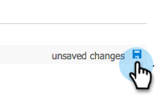

# Passaggio 2 di 3: configurare l&#39;utente Sync per Marketo (on-premises 2013) {#step-of-configure-sync-user-for-marketo-on-premises}

Ottimo lavoro per completare i passaggi precedenti, continuiamo a muoverci attraverso questo.

>[!PREREQUISITES]
>
>[Passaggio 1 di 3: installare la soluzione Marketo in Dynamics (2013 On-Premises)](/help/marketo/product-docs/crm-sync/microsoft-dynamics-sync/sync-setup/connecting-to-legacy-versions/step-1-of-3-install-2013.md){target="_blank"}

## Assegna ruolo utente di sincronizzazione {#assign-sync-user-role}

Assegnare il ruolo Utente di sincronizzazione Marketo solo all&#39;utente di sincronizzazione Marketo. Non è necessario assegnarla ad altri utenti.

>[!NOTE]
>
>Questo vale per il plug-in Marketo versione 4.0.0.14 e successive. Per le versioni precedenti, tutti gli utenti devono avere il ruolo utente di sincronizzazione. Per aggiornare Marketo, vedere [Aggiornare la soluzione Marketo per Microsoft Dynamics](/help/marketo/product-docs/crm-sync/microsoft-dynamics-sync/sync-setup/update-the-marketo-solution-for-microsoft-dynamics.md){target="_blank"}.

>[!IMPORTANT]
>
>L&#39;impostazione della lingua dell&#39;utente di sincronizzazione [ deve essere inglese](https://portal.dynamics365support.com/knowledgebase/article/KA-01201/en-us){target="_blank"}.

1. In **Impostazioni**, fare clic su **Amministrazione**.

   

1. Seleziona **Utenti**.

   

1. Qui verrà visualizzato un elenco di utenti. Selezionare l&#39;utente Marketo Sync dedicato o contattare l&#39;amministratore [Active Directory Federation Services (AFDS)](https://msdn.microsoft.com/en-us/library/bb897402.aspx){target="_blank"} per creare un nuovo utente [dedicato a Marketo](https://blogs.technet.com/b/askpfeplat/archive/2014/04/21/introduction-to-active-directory-federation-services-ad-fs-alternateloginid-feature.aspx){target="_blank"}.

   

1. Selezionare l&#39;utente di sincronizzazione. Fare clic su  e selezionare **[!UICONTROL Gestisci ruoli]**.

   

1. Controlla **[!UICONTROL Utente Marketo Sync]** e fai clic su **[!UICONTROL OK]**.

   

   >[!TIP]
   >
   >Se il ruolo non è visualizzato, torna al [passaggio 1 di 3](/help/marketo/product-docs/crm-sync/microsoft-dynamics-sync/sync-setup/connecting-to-legacy-versions/step-1-of-3-install-2013.md){target="_blank"} e importa la soluzione.

   >[!NOTE]
   >
   >Eventuali aggiornamenti apportati nel CRM dall&#39;utente di sincronizzazione _non_ verranno sincronizzati di nuovo in Marketo.

## Configurare la soluzione Marketo {#configure-marketo-solution}

Quasi completato! Abbiamo solo alcune ultime configurazioni prima di passare al prossimo articolo.

1. In **[!UICONTROL Impostazioni]**, fare clic su **[!UICONTROL Configurazione Marketo]**.

   

   >[!NOTE]
   >
   >Se manca &quot;Configurazione Marketo&quot;, prova ad aggiornare la pagina. Se il problema persiste, [pubblica di nuovo la soluzione Marketo](/help/marketo/product-docs/crm-sync/microsoft-dynamics-sync/sync-setup/connecting-to-legacy-versions/step-1-of-3-install-2013.md) oppure prova a disconnetterti e ad accedere di nuovo.

1. Fare clic su **[!UICONTROL Predefinito]**.

   

1. Fare clic sul campo **[!UICONTROL Utente Marketo]** e selezionare l&#39;utente di sincronizzazione.

   

1. Fai clic su  nell&#39;angolo in basso a destra per salvare le modifiche.

   

1. Fare clic su **[!UICONTROL Publish tutte le personalizzazioni]**.

   

## Prima di procedere al punto 3 {#before-proceeding-to-step}

* Se si desidera limitare il numero di record sincronizzati, [impostare un filtro di sincronizzazione personalizzato](/help/marketo/product-docs/crm-sync/microsoft-dynamics-sync/create-a-custom-dynamics-sync-filter.md){target="_blank"}.
* Eseguire il processo [Convalida Microsoft Dynamics Sync](/help/marketo/product-docs/crm-sync/microsoft-dynamics-sync/sync-setup/validate-microsoft-dynamics-sync.md){target="_blank"}. Verifica che le impostazioni iniziali siano state eseguite correttamente.
* Accedere a Marketo Sync User in Microsoft Dynamics CRM.

Ottimo lavoro!

>[!MORELIKETHIS]
>
>[Passaggio 3 di 3: Connessione di Marketo e Dynamics (on-premise 2013)](/help/marketo/product-docs/crm-sync/microsoft-dynamics-sync/sync-setup/connecting-to-legacy-versions/step-3-of-3-connect-2013.md){target="_blank"}
