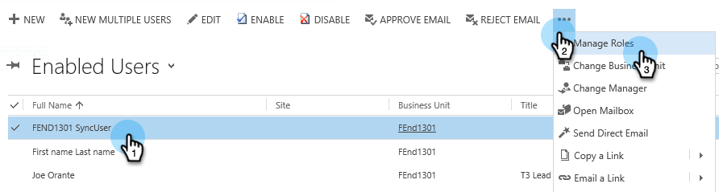

# Passaggio 2 di 3: Configura l’utente di sincronizzazione per Marketo (On-Premises 2013) {#step-of-configure-sync-user-for-marketo-on-premises}

Ottimo lavoro per completare i passaggi precedenti, continuiamo a farlo.

>[!PREREQUISITES]
>
>[Passaggio 1 di 3: Installare la soluzione Marketo in Dynamics (On-Premises 2013)](/help/marketo/product-docs/crm-sync/microsoft-dynamics-sync/sync-setup/microsoft-dynamics-2013-on-premises/step-1-of-3-install.md)

## Assegna ruolo utente di sincronizzazione {#assign-sync-user-role}

Assegna il ruolo utente di sincronizzazione Marketo solo all&#39;utente di sincronizzazione Marketo. Non è necessario assegnarlo ad altri utenti.

>[!NOTE]
>
>Questo vale per il plug-in Marketo versione 4.0.0.14 e successive. Per le versioni precedenti, tutti gli utenti devono avere il ruolo utente di sincronizzazione. Per aggiornare Marketo, vedi [Aggiornare la soluzione Marketo per Microsoft Dynamics](/help/marketo/product-docs/crm-sync/microsoft-dynamics-sync/sync-setup/update-the-marketo-solution-for-microsoft-dynamics.md).

>[!IMPORTANT]
>
>Impostazione della lingua dell&#39;utente di sincronizzazione [deve essere impostato su Inglese](https://portal.dynamics365support.com/knowledgebase/article/KA-01201/en-us).

1. Sotto **Impostazioni**, fai clic su **Amministrazione**.

   

1. Seleziona **Utenti**.

   

1. Verrà visualizzato un elenco di utenti qui. Seleziona l&#39;utente dedicato di Marketo Sync o contatta il tuo [Servizi federativi di Active Directory (AFDS)](https://msdn.microsoft.com/en-us/library/bb897402.aspx) [per creare un nuovo utente dedicato a Marketo.](https://blogs.technet.com/b/askpfeplat/archive/2014/04/21/introduction-to-active-directory-federation-services-ad-fs-alternateloginid-feature.aspx)

   

1. Seleziona l’utente di sincronizzazione. Fai clic su  e seleziona **Gestisci ruoli**

   

1. Controlla **Marketo Sync User** e fai clic su **OK**.

   

   >[!TIP]
   >
   >Se il ruolo non viene visualizzato, torna a [passaggio 1 di 3](/help/marketo/product-docs/crm-sync/microsoft-dynamics-sync/sync-setup/microsoft-dynamics-2013-on-premises/step-1-of-3-install.md) e importa la soluzione.

   >[!NOTE]
   >
   >Eventuali aggiornamenti effettuati nel CRM dall&#39;utente di sincronizzazione verranno **not** essere sincronizzati di nuovo in Marketo.

## Configurare la soluzione Marketo {#configure-marketo-solution}

Quasi finito! Abbiamo solo qualche ultima configurazione prima di passare al prossimo articolo.

1. Sotto **Impostazioni**, fai clic su **Configurazione Marketo**.

   

   >[!NOTE]
   >
   >Se **Configurazione Marketo** mancante, prova ad aggiornare la pagina. Se il problema persiste, [pubblicare la soluzione Marketo](/help/marketo/product-docs/crm-sync/microsoft-dynamics-sync/sync-setup/microsoft-dynamics-2013-on-premises/step-1-of-3-install.md) di nuovo o prova a disconnettersi e di nuovo ad entrare.

1. Fai clic su **Predefinito**.

   

1. Fai clic sul pulsante **Utente Marketo** e seleziona l&#39;utente di sincronizzazione.

   

1. Fai clic su  nell’angolo in basso a destra per salvare le modifiche.

   

1. Fai clic su **Pubblica tutte le personalizzazioni**.

   

## Prima di procedere al passaggio 3 {#before-proceeding-to-step}

* Se si desidera limitare il numero di record sincronizzati, [impostare un filtro di sincronizzazione personalizzato](/help/marketo/product-docs/crm-sync/microsoft-dynamics-sync/create-a-custom-dynamics-sync-filter.md) ora.
* Esegui il [Convalida della sincronizzazione di Microsoft Dynamics](/help/marketo/product-docs/crm-sync/microsoft-dynamics-sync/sync-setup/validate-microsoft-dynamics-sync.md) processo. Verifica che le impostazioni iniziali siano state eseguite correttamente.
* Accedi all’utente di sincronizzazione Marketo in Microsoft Dynamics CRM.

Ottimo lavoro!

>[!MORELIKETHIS]
>
>[Passaggio 3 di 3: Collegare Marketo e Dynamics (On-Premises 2013)](/help/marketo/product-docs/crm-sync/microsoft-dynamics-sync/sync-setup/microsoft-dynamics-2013-on-premises/step-3-of-3-connect.md)
