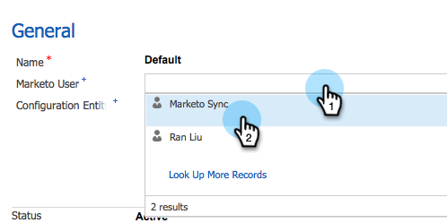

# Passaggio 2 di 3: configurazione di Marketo per [!DNL Dynamics] (on-prem 2015){#step-of-set-up-for-marketo-on-premises-2015}

Ottimo lavoro per completare i passaggi precedenti. Continuiamo a muoverci in questa direzione.

>[!PREREQUISITES]
>
>[Installa Marketo per [!DNL Microsoft Dynamics] 2015 locale Passaggio 1 di 3](/help/marketo/product-docs/crm-sync/microsoft-dynamics-sync/sync-setup/connecting-to-legacy-versions/step-1-of-3-install-2015.md)

## Assegna ruolo utente di sincronizzazione {#assign-sync-user-role}

Assegnare il ruolo Utente di sincronizzazione Marketo solo all&#39;utente di sincronizzazione Marketo. Non è necessario assegnarla ad altri utenti.

>[!NOTE]
>
>Applicabile a Marketo versione 4.0.0.14 e successive. Per le versioni precedenti, tutti gli utenti devono avere il ruolo utente di sincronizzazione. Per aggiornare il Marketo, vedi [Aggiornare la soluzione Marketo per  [!DNL Microsoft Dynamics]](/help/marketo/product-docs/crm-sync/microsoft-dynamics-sync/sync-setup/update-the-marketo-solution-for-microsoft-dynamics.md).

>[!IMPORTANT]
>
>L&#39;impostazione della lingua dell&#39;utente di sincronizzazione [ deve essere inglese](https://learn.microsoft.com/en-us/power-platform/admin/enable-languages){target="_blank"}.

1. In **[!UICONTROL Settings]**, fare clic su **[!UICONTROL Security]**.

   

1. Fai clic su **[!UICONTROL Users]**.

   

1. Qui verrà visualizzato un elenco di utenti. Selezionare l&#39;utente Marketo Sync dedicato o contattare l&#39;amministratore di [Active Directory Federation Services](https://msdn.microsoft.com/en-us/library/bb897402.aspx){target="_blank"} (ADFS) per creare un utente dedicato per Marketo.

   

1. Selezionare l&#39;utente di sincronizzazione. Fai clic su **[!UICONTROL Manage Roles]**.

   

1. Selezionare [!UICONTROL Marketo Sync User] e fare clic su **[!UICONTROL OK]**.

   

   >[!IMPORTANT]
   >
   >L&#39;utente Sync deve disporre dell&#39;autorizzazione di lettura per la configurazione di Marketo.

   >[!TIP]
   >
   >Se il ruolo non è visualizzato, torna al [passaggio 1 di 3](/help/marketo/product-docs/crm-sync/microsoft-dynamics-sync/sync-setup/connecting-to-legacy-versions/step-1-of-3-install-2015.md){target="_blank"} e importa la soluzione.

   >[!NOTE]
   >
   >Eventuali aggiornamenti apportati nel CRM dall&#39;utente di sincronizzazione _non_ verranno sincronizzati di nuovo in Marketo.

## Configurare la soluzione Marketo {#configure-marketo-solution}

Quasi completato! Abbiamo solo alcune ultime configurazioni prima di passare al prossimo articolo.

1. In **[!UICONTROL Settings]**, fare clic su **[!UICONTROL Marketo Config]**.

   

   >[!NOTE]
   >
   >Se manca la configurazione Marketo, prova ad aggiornare la pagina. Se il problema persiste, [pubblicare la soluzione Marketo](/help/marketo/product-docs/crm-sync/microsoft-dynamics-sync/sync-setup/connecting-to-legacy-versions/step-1-of-3-install-2015.md){target="_blank"} o provare a disconnettersi e ad accedere di nuovo.

1. Fai clic su **[!UICONTROL Default]**.

   

1. Fare clic sul campo **[!UICONTROL Marketo User]** e selezionare l&#39;utente di sincronizzazione.

   

1. Fai clic sull’icona Salva nell’angolo in basso a destra.

   

1. Fai clic su **[!UICONTROL Publish All Customizations]**.

   

   >[!NOTE]
   >
   >L&#39;utente Sync deve disporre dell&#39;autorizzazione di lettura per la configurazione di Marketo.

## Prima di procedere al punto 3 {#before-proceeding-to-step}

* Se si desidera limitare il numero di record sincronizzati, [impostare un filtro di sincronizzazione personalizzato](/help/marketo/product-docs/crm-sync/microsoft-dynamics-sync/create-a-custom-dynamics-sync-filter.md).
* Esegui il processo [Convalida [!DNL Microsoft Dynamics] Sincronizza](/help/marketo/product-docs/crm-sync/microsoft-dynamics-sync/sync-setup/validate-microsoft-dynamics-sync.md). Verifica che le impostazioni iniziali siano state eseguite correttamente.
* Accedere all&#39;utente di Marketo Sync in [!DNL Microsoft Dynamics] CRM.

>[!MORELIKETHIS]
>
>[Installa Marketo per [!DNL Microsoft Dynamics] 2015 locale Passaggio 3 di 3](/help/marketo/product-docs/crm-sync/microsoft-dynamics-sync/sync-setup/connecting-to-legacy-versions/step-3-of-3-connect-2015.md)
