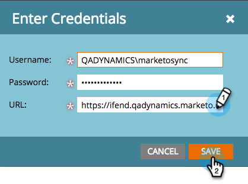

# Passaggio 3 di 3: Collegare Microsoft Dynamics con Marketo (On-Premises 2011) {#step-of-connect-microsoft-dynamics-with-marketo-on-premises}

Bene! Abbiamo installato la soluzione e configurato l&#39;utente di sincronizzazione. Successivamente, è necessario collegare Marketo e Dynamics.

>[!PREREQUISITES]
>
>* [Passaggio 1 di 3: Installare la soluzione Marketo (On-Premises 2011)](/help/marketo/product-docs/crm-sync/microsoft-dynamics-sync/sync-setup/microsoft-dynamics-2011-on-premises/step-1-of-3-install.md)
>* [Passaggio 2 di 3: Configurazione dell’utente di sincronizzazione Marketo in Dynamics (On-Premises 2011)](/help/marketo/product-docs/crm-sync/microsoft-dynamics-sync/sync-setup/microsoft-dynamics-2011-on-premises/step-2-of-3-set-up.md)

>[!NOTE]
>
>**Autorizzazioni amministratore richieste**

## Immetti le informazioni utente di Dynamics Sync {#enter-dynamics-sync-user-information}

1. Accedi a Marketo e fai clic su **Amministratore**.

   

1. Fai clic su **CRM**.

   

1. Fai clic su **Microsoft**.

   

1. Fai clic su **Modifica** in **Passaggio 1: Immetti le credenziali.**

   

   >[!CAUTION]
   >
   >Assicurati che le tue credenziali siano corrette in quanto non è possibile ripristinare le successive modifiche dello schema dopo l’invio. Se vengono salvate le credenziali errate, sarà necessario ottenere una nuova sottoscrizione Marketo.

1. Inserisci il **Nome utente**, **Password** e CRM **URL** quindi fai clic su **Salva**.

   

   >[!NOTE]
   >
   >* Il nome utente in Marketo deve corrispondere al nome utente per l&#39;utente di sincronizzazione in CRM. Il formato può essere `user@domain.com` o DOMINIO\utente.
   >* Se non conosci l’URL, [scopri come trovarlo qui](/help/marketo/product-docs/crm-sync/microsoft-dynamics-sync/sync-setup/view-the-organization-service-url.md).

## Seleziona campi da sincronizzare {#select-fields-to-sync}

Ora è necessario selezionare i campi su cui si desidera eseguire la sincronizzazione.

1. Fai clic su **Modifica** in **Passaggio 2: Selezionare Campi da sincronizzare.**

   

1. Sono presenti campi preselezionati che verranno sincronizzati. Aggiungi altro, se lo desideri, e fai clic su **Salva**.

   

   >[!NOTE]
   >
   >Marketo memorizza un riferimento ai campi da sincronizzare. Se elimini un campo in Dynamics, è consigliabile eseguire questa operazione con la [sincronizzazione disabilitata](/help/marketo/product-docs/crm-sync/salesforce-sync/enable-disable-the-salesforce-sync.md). Quindi aggiorna lo schema in Marketo modificando e salvando il [Seleziona campi da sincronizzare](/help/marketo/product-docs/crm-sync/microsoft-dynamics-sync/microsoft-dynamics-sync-details/microsoft-dynamics-sync-field-sync/editing-fields-to-sync-before-deleting-them-in-dynamics.md).

## Campi di sincronizzazione per un filtro personalizzato {#sync-fields-for-a-custom-filter}

Se hai creato un filtro personalizzato, assicurati di entrare e selezionare i nuovi campi da sincronizzare con Marketo.

1. Vai ad Amministratore e seleziona **Microsoft Dynamics**.

   

1. Fai clic su **Modifica** in Dettagli sincronizzazione campo.

   

1. Scorri verso il basso fino al campo e controllalo. Il nome effettivo deve essere new_synctomkto ma il nome visualizzato può essere qualsiasi cosa. Fai clic su **Salva**.

   

## Abilita sincronizzazione {#enable-sync}

1. Fai clic su **Modifica** in **Passaggio 3: Abilita sincronizzazione**.

   

   >[!CAUTION]
   >
   >Marketo non eseguirà automaticamente il deduplicazione rispetto a una sincronizzazione di Microsoft Dynamics o quando immetti manualmente persone o lead.

1. Leggi tutto nella finestra a comparsa, inserisci il tuo messaggio e-mail e fai clic su **Avvia sincronizzazione**.

   

1. La prima sincronizzazione potrebbe richiedere alcune ore. Al termine riceverai una notifica e-mail.

   

   Ottimo lavoro!
