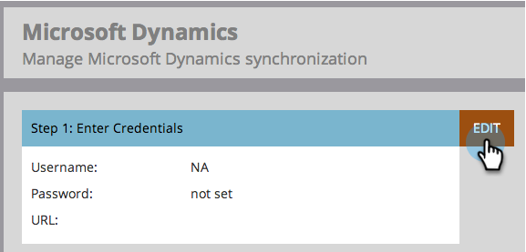

# Passaggio 3 di 3: Connessione di Marketo e Dynamics (on-premise 2013) {#step-of-connect-marketo-and-dynamics-on-premises}

Va bene! Abbiamo installato la soluzione e configurato l&#39;utente di sincronizzazione. Successivamente, è necessario collegare Marketo Engage e Dynamics.

>[!PREREQUISITES]
>
>* [Passaggio 1 di 3: installare la soluzione Marketo in Dynamics (2013 On-Premises)](/help/marketo/product-docs/crm-sync/microsoft-dynamics-sync/sync-setup/connecting-to-legacy-versions/step-1-of-3-install-2013.md){target="_blank"}
>* [Passaggio 2 di 3: configurare l&#39;utente di sincronizzazione per Marketo (2013 on-premise)](/help/marketo/product-docs/crm-sync/microsoft-dynamics-sync/sync-setup/connecting-to-legacy-versions/step-2-of-3-configure-2013.md){target="_blank"}

>[!NOTE]
>
>**Autorizzazioni amministratore richieste**

## Immetti le informazioni utente di Dynamics Sync {#enter-dynamics-sync-user-information}

1. Accedere a Marketo e fare clic su **[!UICONTROL Admin]**.

   

1. Fai clic su **[!UICONTROL CRM]**.

   

1. Seleziona **[!DNL Microsoft]**.

   

1. Fare clic su **[!UICONTROL Edit]** in **[!UICONTROL Enter Credentials]**.

   

   >[!CAUTION]
   >
   >Assicurati che le credenziali siano corrette in quanto non è possibile ripristinare le modifiche allo schema successive dopo l’invio. Se vengono salvate credenziali non corrette, dovrai ottenere una nuova sottoscrizione Marketo.

1. Immettere **[!UICONTROL Username]**, **[!UICONTROL Password]** e Microsoft Dynamics **[!UICONTROL URL]**, quindi fare clic su **[!UICONTROL Save]**.

   

   >[!NOTE]
   >
   >* Il nome utente in Marketo deve corrispondere al nome utente per l&#39;utente di sincronizzazione in CRM. Il formato può essere `user@domain.com` o DOMINIO\utente.
   >* Se non conosci l&#39;URL, [scopri come trovarlo qui](/help/marketo/product-docs/crm-sync/microsoft-dynamics-sync/sync-setup/view-the-organization-service-url.md){target="_blank"}.

## Seleziona campi da sincronizzare {#select-fields-to-sync}

Ora è necessario selezionare i campi da sincronizzare.

1. Fare clic su **[!UICONTROL Edit]** in **[!UICONTROL Select Fields to Sync]**.

   

1. Seleziona i campi da sincronizzare con Marketo in modo che siano preselezionati. Fai clic su **[!UICONTROL Save]**.

   

   >[!NOTE]
   >
   >Marketo memorizza un riferimento ai campi da sincronizzare. Se elimini un campo in Dynamics, è consigliabile eliminare [sync disabilitato](/help/marketo/product-docs/crm-sync/salesforce-sync/enable-disable-the-salesforce-sync.md){target="_blank"}. Quindi aggiorna lo schema in Marketo modificando e salvando [Seleziona campi da sincronizzare](/help/marketo/product-docs/crm-sync/microsoft-dynamics-sync/microsoft-dynamics-sync-details/microsoft-dynamics-sync-field-sync/editing-fields-to-sync-before-deleting-them-in-dynamics.md){target="_blank"}.

## Sincronizza campi per un filtro personalizzato {#sync-fields-for-a-custom-filter}

Se hai creato un filtro personalizzato, accertati di entrare e selezionare i nuovi campi da sincronizzare con Marketo.

1. Vai all&#39;amministratore e seleziona **[!UICONTROL Microsoft Dynamics]**.

   

1. Fare clic su **[!UICONTROL Edit]** in Dettagli sincronizzazione campi.

   

1. Scorri verso il basso fino al campo e selezionalo. Il nome effettivo deve essere new_synctomkto, ma il nome visualizzato può essere qualsiasi cosa. Fai clic su **[!UICONTROL Save]**.

   

## Abilita sincronizzazione {#enable-sync}

1. Fare clic su **[!UICONTROL Edit]** in **[!UICONTROL Enable Sync]**.

   

   >[!CAUTION]
   >
   >Marketo non esegue automaticamente la deduplicazione su una sincronizzazione Microsoft Dynamics o quando si immettono manualmente persone o lead.

1. Leggi tutto il contenuto del popup, immetti il tuo indirizzo e-mail e fai clic su **[!UICONTROL Start Sync]**.

   

1. A seconda del numero di record, la sincronizzazione iniziale può richiedere da alcune ore a pochi giorni. Al termine riceverai una notifica e-mail.

   

>[!MORELIKETHIS]
>
>[Installare e configurare Marketo Sales Insight in Microsoft Dynamics 2013](/help/marketo/product-docs/marketo-sales-insight/msi-for-microsoft-dynamics/installing/install-and-configure-marketo-sales-insight-in-microsoft-dynamics-2013.md){target="_blank"}
