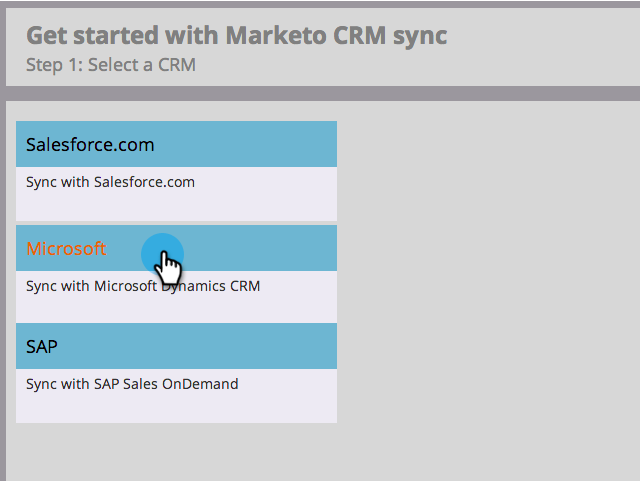

# Passaggio 3 di 3: Connessione a Marketo Dynamics (on-prem 2015) {#step-of-connect-marketo-dynamics-on-premises-2015}

>[!PREREQUISITES]
>
>* [Installazione di Marketo per Microsoft Dynamics 2015 on-premise - Passaggio 1 di 3](/help/marketo/product-docs/crm-sync/microsoft-dynamics-sync/sync-setup/connecting-to-legacy-versions/step-1-of-3-install-2015.md)
>* [Installazione di Marketo per Microsoft Dynamics 2015 on-premise - Passaggio 2 di 3](/help/marketo/product-docs/crm-sync/microsoft-dynamics-sync/sync-setup/connecting-to-legacy-versions/step-2-of-3-set-up-2015.md)

>[!NOTE]
>
>**Autorizzazioni amministratore richieste**

## Immetti le informazioni utente di Dynamics Sync {#enter-dynamics-sync-user-information}

1. Accedi a Marketo e fai clic su **Amministratore**.

   

1. Clic **CRM**.

   

1. Seleziona **Microsoft**.

   

1. Clic **Modifica** in **Passaggio 1: immettere le credenziali**.

   

   >[!CAUTION]
   >
   >Assicurati che le credenziali siano corrette in quanto non è possibile ripristinare le modifiche allo schema successive dopo l’invio. Se vengono salvate credenziali errate, dovrai ottenere una nuova sottoscrizione Marketo.

1. Inserisci il **Nome utente**, **Password** a Microsoft Dynamics **URL**, e un **ID client/segreto**. Clic **Salva** al termine.

   

   >[!NOTE]
   >
   >* Se il provisioning del tuo Marketo è stato eseguito prima di ottobre 2020, ID client e Segreto sono campi facoltativi. Altrimenti sono obbligatori. L&#39;ottenimento di queste informazioni dipenderà dalla versione di MSD in uso.
   >* Il nome utente in Marketo deve corrispondere al nome utente per l&#39;utente di sincronizzazione in CRM. Il formato è `user@domain.com` o DOMINIO\utente.
   >* Se non conosci l’URL, [scopri come trovarlo qui](/help/marketo/product-docs/crm-sync/microsoft-dynamics-sync/sync-setup/view-the-organization-service-url.md).

   >[!TIP]
   >
   >Non conosci l’URL? Ti mostreremo come trovare il tuo [URL servizio organizzazione Dynamics](/help/marketo/product-docs/crm-sync/microsoft-dynamics-sync/sync-setup/view-the-organization-service-url.md) qui.

## Seleziona campi da sincronizzare {#select-fields-to-sync}

1. Clic **Modifica** in **Passaggio 2: selezionare i campi da sincronizzare**.

   

1. Seleziona i campi da sincronizzare con Marketo in modo che siano preselezionati. Clic **Salva**.

   

>[!NOTE]
>
>Marketo memorizza un riferimento ai campi da sincronizzare. Se elimini un campo in Dynamics, è consigliabile eseguire questa operazione con [sincronizzazione disabilitata](/help/marketo/product-docs/crm-sync/salesforce-sync/enable-disable-the-salesforce-sync.md). Quindi aggiorna lo schema in Marketo modificando e salvando il file [Seleziona campi da sincronizzare](/help/marketo/product-docs/crm-sync/microsoft-dynamics-sync/microsoft-dynamics-sync-details/microsoft-dynamics-sync-field-sync/editing-fields-to-sync-before-deleting-them-in-dynamics.md).

## Sincronizza campi per un filtro personalizzato {#sync-fields-for-a-custom-filter}

Se hai creato un filtro personalizzato, accertati di entrare e selezionare i nuovi campi da sincronizzare con Marketo.

1. Vai a Amministratore e seleziona **Microsoft Dynamics**.

   

1. Clic **Modifica** in Dettagli sincronizzazione campi.

   

1. Scorri verso il basso fino al campo e selezionalo. Il nome effettivo deve essere new_synctomkto, ma il nome visualizzato può essere qualsiasi cosa. Clic **Salva**.

   

## Abilita sincronizzazione {#enable-sync}

1. Clic **Modifica** in **Passaggio 3: abilitare la sincronizzazione**.

   

   >[!CAUTION]
   >
   >Marketo non eseguirà automaticamente la deduplicazione in base a una sincronizzazione Microsoft Dynamics o quando si immettono manualmente persone.

1. Leggi tutto il contenuto del pop-up, immetti il tuo indirizzo e-mail e fai clic su **Avvia sincronizzazione**.

   

1. La prima sincronizzazione potrebbe richiedere alcune ore. Al termine riceverai una notifica e-mail.

   

Ottimo lavoro!
