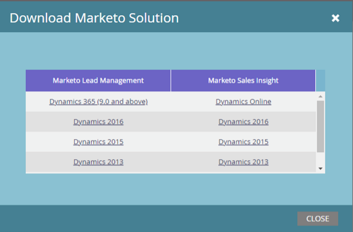

# Scaricare la soluzione di gestione dei lead Marketo {#download-the-marketo-lead-management-solution}

>[!NOTE]
>
>**Autorizzazioni amministratore richieste**

Per avviare la sincronizzazione, è necessario scaricare e installare una soluzione Marketo nell&#39;account [!DNL Microsoft Dynamics].

>[!CAUTION]
>
>è fondamentale scaricare la soluzione Marketo più recente _prima_ di eseguire qualsiasi aggiornamento.

>[!NOTE]
>
>Al momento, Marketo supporta solo i certificati SSL compatibili con Java 7.

1. Passa alla schermata **[!UICONTROL Admin]**.

   

1. Fai clic su **[!UICONTROL CRM]**.

   

1. Seleziona **[!DNL Microsoft]**.

   

1. Seleziona **[!UICONTROL Download Marketo Solution]**.

   

1. Selezionare la soluzione appropriata per la versione [!DNL Microsoft Dynamics].

   

Ora sul dispositivo viene scaricato un file zip della soluzione.
