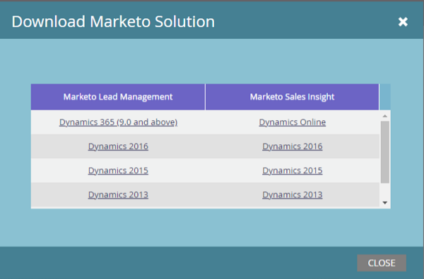

# Scarica la soluzione di gestione dei lead Marketo {#download-the-marketo-lead-management-solution}

>[!NOTE]
>
>**Autorizzazioni amministratore richieste**

Per avviare la sincronizzazione, è necessario scaricare e installare una soluzione di Marketo Engage nell&#39;account Microsoft Dynamics.

>[!CAUTION]
>
>È fondamentale scaricare la soluzione Marketo più recente _prima di_ esecuzione di qualsiasi aggiornamento.

>[!NOTE]
>
>Al momento, Marketo supporta solo i certificati SSL compatibili con Java 7.

1. Vai a **[!UICONTROL Amministratore]** area.

   

1. Fai clic su **[!UICONTROL CRM]**.

   

1. Seleziona **[!DNL Microsoft]**.

   

1. Seleziona **[!UICONTROL Scarica la soluzione Marketo]**.

   

1. Seleziona la soluzione appropriata per la versione di Microsoft Dynamics.

   

Fantastico! Ora sul dispositivo viene scaricato un file zip della soluzione.
