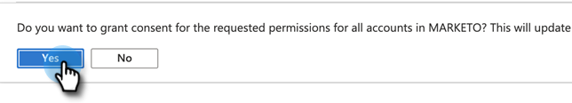

# Concedere il consenso per la registrazione di ID client e app {#grant-consent-for-client-id-and-app-registration}

## Concedere le autorizzazioni agli utenti delegati per l&#39;utente di sincronizzazione {#grant-delegated-user-permissions-for-the-sync-user}

1. Utilizzare un programma di testo normale (Blocco note per Windows, Modifica testo per Mac) per creare un URI (Uniform Resource Identifier) per l&#39;autorizzazione incollando il testo seguente e sostituendo i valori client_id, redirect_uri e state.

   ```
   https://login.microsoftonline.com/common/oauth2/authorize?
   client_id='xxxxxx-xxxx-xxxx-xxxx-xxxxxxxx'
   &response_type='code'
   &redirect_uri='https://www.<ourdomain>.com'
   &response_mode='query'
   &state='SOME_UNIQUE_UID'
   client_id value should be the client_id generated in App Registration process
   redirect_uri value should be same as value entered at the time of App registration-> Redirect URIs
   state value can be any ID (e.g.,12345)
   ```

   <table> 
    <colgroup> 
     <col> 
     <col> 
    </colgroup> 
    <tbody> 
     <tr> 
      <td><strong>valore client_id</strong></td> 
      <td>deve essere il client_id generato nel processo di registrazione dell'app</td> 
     </tr> 
     <tr> 
      <td><strong>valore redirect_uri</strong></td> 
      <td>deve essere uguale al valore immesso al momento della registrazione dell’app &gt; URI di reindirizzamento</td> 
     </tr> 
     <tr> 
      <td><strong>valore di stato</strong></td> 
      <td>può essere qualsiasi ID (ad es. 12345)</td> 
     </tr> 
    </tbody> 
   </table>

   L’URL finale sarà simile al seguente: `https://login.microsoftonline.com/common/oauth2/authorize?client_id=xxxxxx-xxxx-xxxx-xxxx-xxxxxxxx&response_type=code&redirect_uri=https://www.marketo.com&response_mode=query&state=12345`

1. Apri l’URI creato in qualsiasi browser.

   

1. Accedi come utente di sincronizzazione per il quale stai concedendo le autorizzazioni.

   

   >[!NOTE]
   >
   >Se hai già effettuato l’accesso ad Azure come Amministratore in un’altra scheda, dovrai utilizzare un browser diverso o la modalità in incognito per accedere come utente di sincronizzazione.

1. Clic **Accetta**.

   

## Concedi il consenso per tutti gli utenti {#grant-consent-for-all-users}

In qualità di amministratore, puoi anche acconsentire alle autorizzazioni delegate di un’applicazione per conto di tutti gli utenti nel tenant. Il consenso amministrativo impedisce la visualizzazione della finestra di dialogo del consenso per ogni utente nel tenant e può essere eseguito nel portale di Azure dagli utenti con il ruolo di amministratore. Scopri quali ruoli amministratore possono [consenso alle autorizzazioni delegate qui](https://docs.microsoft.com/en-us/azure/active-directory/roles/permissions-reference).

1. Nel portale di Azure, passa alla home page dell’applicazione.

1. In Gestisci, fai clic su **Autorizzazioni API**.

   

1. Fai clic su **Concedere il consenso dell’amministratore** (per tenant).

   

1. Clic **Sì** per confermare.

   

