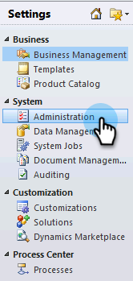
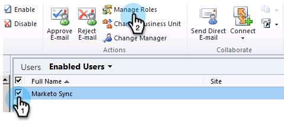

# Passaggio 2 di 3: Impostazione della sincronizzazione degli utenti di Marketing in Dynamics (On-Premises 2011) {#step-of-set-up-marketo-sync-user-in-dynamics-on-premises}

Ottimo lavoro per completare i passaggi precedenti, continuiamo a farlo.

>[!PREREQUISITES]
>
>* [Passaggio 1 di 3: Installare la soluzione Marketo (On-Premises 2011)](step-1-of-3-install.md)

>

## Assegna ruolo utente sincronizzazione {#assign-sync-user-role}

Assegnate il ruolo di sincronizzazione utente Marketo solo all’utente di sincronizzazione Marketo. Non è necessario assegnarlo ad altri utenti.

>[!NOTE]
>
>Questo vale per il plug-in Marketo versione 4.0.0.14 e successive. Per le versioni precedenti, tutti gli utenti devono avere il ruolo di utente di sincronizzazione. Per aggiornare Marketo, consulta [Aggiornamento della soluzione Marketo per Microsoft Dynamics](../../../../../product-docs/crm-sync/microsoft-dynamics-sync/sync-setup/download-the-marketo-lead-management-solution/upgrade-the-marketo-solution-for-microsoft-dynamics.md).

1. Nel menu in basso a sinistra, selezionate **Impostazioni**.

   

1. Nella struttura ad albero, selezionate **Amministrazione**.

   

1. Selezionate **Utenti**.

   

1. Verrà visualizzato un elenco di utenti qui. Selezionate l&#39;utente dedicato a Marketo per la sincronizzazione o contattate il vostro amministratore AFDS ( [Active Directory Federation Services)](https://msdn.microsoft.com/en-us/library/bb897402.aspx) per creare un nuovo utente dedicato a Marketo. Fate clic su **Gestisci ruoli**.

   

1. Selezionate **Marketo per sincronizzare l’utente** e fate clic su **OK**.

   

   >[!TIP]
   >
   >Se il ruolo non viene visualizzato, tornate al [punto 1 di 3](step-1-of-3-install.md) e importate la soluzione.

   >[!NOTE]
   >
   >Eventuali aggiornamenti apportati in CRM dall&#39;utente di sincronizzazione **non** verranno sincronizzati di nuovo su Marketo.

## Configurare la soluzione Marketo {#configure-marketo-solution}

Quasi fatto! Abbiamo solo qualche ultima configurazione prima di passare all&#39;articolo successivo.

1. Selezionate **Impostazioni**. Selezionare quindi **Marketo Config **nella struttura.

   

   >[!NOTE]
   >
   >Se manca la configurazione Marketo, provare ad aggiornare la pagina. Se il problema persiste, [pubblicate nuovamente](step-1-of-3-install.md) la soluzione Marketo oppure disconnettetevi ed effettuate nuovamente l&#39;accesso.

1. Fate clic su **Predefinito**.

   

1. Clicca su 

   

1. Nella finestra a comparsa, selezionate l’utente di sincronizzazione. Fate clic su **OK**.

   

1. Fate clic su **Salva** per salvare le modifiche.

   

1. Fate clic su **Pubblica tutte le personalizzazioni**.

   

## Prima di procedere allo stadio 3 {#before-proceeding-to-step}

    * Se si desidera limitare il numero di record sincronizzati, [impostare un filtro di sincronizzazione personalizzato](../../../../../product-docs/crm-sync/microsoft-dynamics-sync/create-a-custom-dynamics-sync-filter.md) ora.
    * Eseguire il processo [Validate Microsoft Dynamics Sync](../../../../../product-docs/crm-sync/microsoft-dynamics-sync/sync-setup/validate-microsoft-dynamics-sync.md). Verifica che le impostazioni iniziali siano state eseguite correttamente.
    * Accedere all&#39;utente di sincronizzazione Marketo in Microsoft Dynamics CRM.

Ottimo lavoro!

>[!NOTE]
>
>**Articoli correlati**
>
>[Passaggio 3 di 3: Connect Microsoft Dynamics con Marketo (On-Premises 2011)](step-3-of-3-connect.md)

