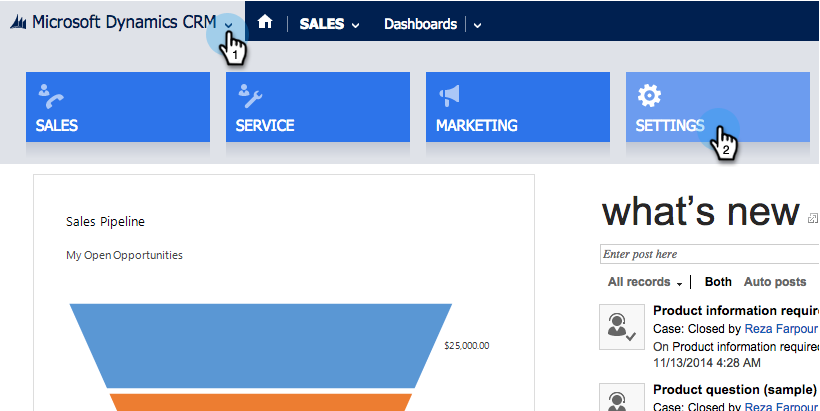
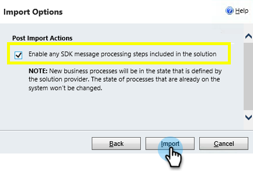

# Passaggio 1 di 3: Installare la soluzione Marketo in Dynamics (On-Premises 2013) {#step-of-install-the-marketo-solution-in-dynamics-on-premises}

Prima di poter sincronizzare Microsoft Dynamics On-Premises e Marketo, è necessario installare la soluzione Marketo in Dynamics.

>[!NOTE]
>
>Dopo aver sincronizzato Marketo con un CRM, non puoi eseguire una nuova sincronizzazione senza sostituire l&#39;istanza.

>[!PREREQUISITES]
>
>È necessario avere [Internet Facing Deployment](http://www.microsoft.com/en-us/download/confirmation.aspx?id=41701) (IFD) configurato con [Active Directory Federation Services](https://msdn.microsoft.com/en-us/library/bb897402.aspx) 2.0, 2.1 o 3.0 (ADFS). Nota: Il documento IFD viene scaricato automaticamente quando si fa clic sul collegamento.
>
>[Scarica la soluzione](../../../../../product-docs/crm-sync/microsoft-dynamics-sync/sync-setup/download-the-marketo-lead-management-solution.md) Marketo prima di iniziare.

>[!NOTE]
>
>**Autorizzazioni di amministrazione di Dynamics richieste.**
>
>Per eseguire questa sincronizzazione, sono necessari i privilegi di amministratore CRM.

1. Accedi a **Dynamics**. Fare clic sul menu a discesa **Microsoft Dynamics CRM** e selezionare **IMPOSTAZIONI**.

   

1. In **IMPOSTAZIONI**, selezionare **SOLUZIONI**.

   

1. Fate clic su **Importa**.

   

1. Fate clic su **Sfoglia** e selezionate la soluzione scaricata. Fate clic su **Avanti**.

   

1. Visualizzate le Informazioni sulla soluzione e fate clic su **Visualizza i dettagli** del pacchetto della soluzione.

   

1. Dopo aver controllato tutti i dettagli, fare clic su **Chiudi**.

   

1. Nella pagina Informazioni sulla soluzione, fate clic su **Avanti**.

   

1. Accertati che l’opzione SDK sia selezionata. Fate clic su **Importa**.

   

1. Attendere il termine dell&#39;importazione.

   >[!TIP]
   >
   >Sarà necessario abilitare i pop-up nel browser per completare il processo di installazione.

   

1. Scaricate un file di registro (se lo desiderate) e fate clic su **Chiudi**.

   >[!NOTE]
   >
   >È possibile che venga visualizzato un messaggio con la dicitura &quot;Gestione lead Marketo completata con un avviso&quot;. Ciò è pienamente atteso.

   

1. Marketing Lead Management verrà ora visualizzato nella pagina **Tutte le soluzioni** .

   

1. Selezionate la soluzione Marketo e fate clic su **Pubblica tutte le personalizzazioni**.

   

Non era troppo male, giusto? Avanti, continuerò a passarvi attraverso il resto.

>[!CAUTION]
>
>La disattivazione di uno qualsiasi dei processi di messaggistica SDK di Marketo comporterà l&#39;interruzione dell&#39;installazione.

>[!NOTE]
>
>**Articoli correlati**
>
>* [Passaggio 2 di 3: Configurare l&#39;utente di sincronizzazione per Marketo (On-Premises 2013)](step-2-of-3-configure.md)

>

