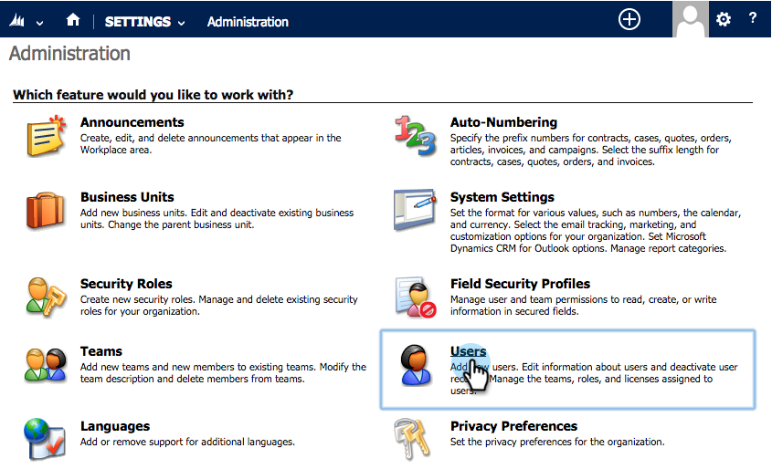
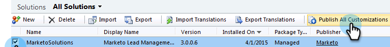

# Passaggio 2 di 3: Configurare l&#39;utente di sincronizzazione per Marketo (2013 On-Premises) {#step-of-configure-sync-user-for-marketo-on-premises}

Ottimo lavoro per completare i passaggi precedenti, continuiamo a farlo.

>[!PREREQUISITES]
>
>[Passaggio 1 di 3: Installare la soluzione Marketo in Dynamics (On-Premises 2013)](/help/marketo/product-docs/crm-sync/microsoft-dynamics-sync/sync-setup/microsoft-dynamics-2013-on-premises/step-1-of-3-install.md)

## Assegna ruolo utente sincronizzazione {#assign-sync-user-role}

Assegnate il ruolo di sincronizzazione utente Marketo solo all’utente di sincronizzazione Marketo. Non è necessario assegnarlo ad altri utenti.

>[!NOTE]
>
>Questo vale per il plug-in Marketo versione 4.0.0.14 e successive. Per le versioni precedenti, tutti gli utenti devono avere il ruolo di utente di sincronizzazione. Per aggiornare Marketo, vedere [Aggiornamento della soluzione Marketo per Microsoft Dynamics](/help/marketo/product-docs/crm-sync/microsoft-dynamics-sync/sync-setup/upgrade-the-marketo-solution-for-microsoft-dynamics.md).

1. In **Impostazioni**, fare clic su **Amministrazione**.

   

1. Selezionare **Utenti**.

   

1. Verrà visualizzato un elenco di utenti qui. Seleziona l&#39;utente dedicato per la sincronizzazione di Marketo o contatta l&#39;amministratore [Active Directory Federation Services (AFDS)](https://msdn.microsoft.com/en-us/library/bb897402.aspx) [per creare un nuovo utente dedicato a Marketo.](https://blogs.technet.com/b/askpfeplat/archive/2014/04/21/introduction-to-active-directory-federation-services-ad-fs-alternateloginid-feature.aspx)

   

1. Selezionate l’utente di sincronizzazione. Fare clic su  e selezionare **Gestisci ruoli**

   

1. Selezionare **Marketo Sync User** e fare clic su **OK**.

   

   >[!TIP]
   >
   >Se il ruolo non è visualizzato, tornare al [passaggio 1 di 3](/help/marketo/product-docs/crm-sync/microsoft-dynamics-sync/sync-setup/microsoft-dynamics-2013-on-premises/step-1-of-3-install.md) e importare la soluzione.

   >[!NOTE]
   >
   >Eventuali aggiornamenti effettuati in CRM dall&#39;utente di sincronizzazione **non** verranno sincronizzati nuovamente in Marketo.

## Configurare la soluzione Marketo {#configure-marketo-solution}

Quasi fatto! Abbiamo solo qualche ultima configurazione prima di passare all&#39;articolo successivo.

1. In **Impostazioni**, fare clic su **Configurazione marketing**.

   

   >[!NOTE]
   >
   >Se **Configurazione del marketing** non è presente, provare ad aggiornare la pagina. Se il problema persiste, [pubblicare di nuovo la soluzione Marketo](/help/marketo/product-docs/crm-sync/microsoft-dynamics-sync/sync-setup/microsoft-dynamics-2013-on-premises/step-1-of-3-install.md) oppure provare a disconnettersi e rientrare.

1. Fare clic su **Default**.

   

1. Fate clic sul campo **Marketing User** e selezionate l&#39;utente di sincronizzazione.

   

1. Fate clic su  nell&#39;angolo in basso a destra per salvare le modifiche.

   

1. Fate clic su **Pubblica tutte le personalizzazioni**.

   

## Prima di procedere al passaggio 3 {#before-proceeding-to-step}

* Se si desidera limitare il numero di record sincronizzati, [impostare ora un filtro di sincronizzazione personalizzato](/help/marketo/product-docs/crm-sync/microsoft-dynamics-sync/create-a-custom-dynamics-sync-filter.md).
* Eseguire il processo [Validate Microsoft Dynamics Sync](/help/marketo/product-docs/crm-sync/microsoft-dynamics-sync/sync-setup/validate-microsoft-dynamics-sync.md). Verifica che le impostazioni iniziali siano state eseguite correttamente.
* Accedi a Marketing per sincronizzare l&#39;utente in Microsoft Dynamics CRM.

Ottimo lavoro!

>[!MORELIKETHIS]
>
>[Passaggio 3 di 3: Connect Marketo e Dynamics (On-Premises 2013)](/help/marketo/product-docs/crm-sync/microsoft-dynamics-sync/sync-setup/microsoft-dynamics-2013-on-premises/step-3-of-3-connect.md)
