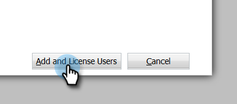
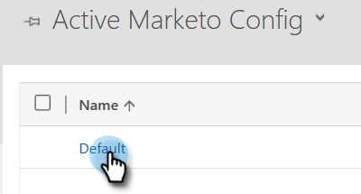

# Passaggio 2 di 4: configurare la soluzione Marketo con la connessione di controllo della password del proprietario della risorsa {#step-2-of-4-set-up-the-marketo-solution-ropc}

Iniziamo creando un account utente.

>[!PREREQUISITES]
>
>[Passaggio 1 di 4: installare la soluzione Marketo con la connessione di controllo della password del proprietario della risorsa](/help/marketo/product-docs/crm-sync/microsoft-dynamics-sync/sync-setup/microsoft-dynamics-365-with-ropc-connection/step-1-of-4-install.md)

## Crea un nuovo utente {#create-a-new-user}

1. Accedi a Dynamics. Fai clic sull’icona Impostazioni e seleziona **Impostazioni avanzate**.

   

1. Clic **Impostazioni** e seleziona **Sicurezza**.

   

1. Clic **Utenti**.

   

1. Clic **Nuovo.**

   

1. Clic **Aggiungi e concedi licenze agli utenti** nella nuova finestra.

   

1. Viene visualizzata una nuova scheda. Clic **Amministratore** nella parte superiore della pagina.

   

1. Viene visualizzata un’altra nuova scheda. Clic **Aggiungi un utente**.

   

   >[!IMPORTANT]
   >
   >L&#39;utente Sync deve disporre dell&#39;autorizzazione di lettura per la configurazione di Marketo.

1. Immettere tutte le informazioni. Al termine, fai clic su **Aggiungi**.

   

   >[!NOTE]
   >
   >Questo nome deve essere un utente di sincronizzazione dedicato e non un account utente CRM esistente. Non deve essere un indirizzo e-mail effettivo.

1. Immetti l’e-mail per ricevere le nuove credenziali utente e fai clic su **Invia e-mail e chiudi**.

   

## Assegna ruolo utente di sincronizzazione {#assign-sync-user-role}

Assegnare il ruolo Utente di sincronizzazione Marketo solo all&#39;utente di sincronizzazione Marketo. Non è necessario assegnarla ad altri utenti.

>[!NOTE]
>
>Questo vale per Marketo versione 4.0.0.14 e successive. Per le versioni precedenti, tutti gli utenti devono avere il ruolo utente di sincronizzazione. Per aggiornare Marketo, consulta [Aggiornamento della soluzione Marketo per Microsoft Dynamics](/help/marketo/product-docs/crm-sync/microsoft-dynamics-sync/sync-setup/update-the-marketo-solution-for-microsoft-dynamics.md).

>[!IMPORTANT]
>
>Impostazione della lingua dell&#39;utente di sincronizzazione [deve essere impostato su English](https://portal.dynamics365support.com/knowledgebase/article/KA-01201/en-us).

1. Torna alla scheda Utenti abilitati e aggiorna l’elenco degli utenti.

   

1. Passa il puntatore del mouse accanto al nuovo utente di Marketo Sync creato, quindi viene visualizzata una casella di controllo. Fai clic su per selezionarlo.

   

1. Clic **Gestisci ruoli**.

   

1. Verifica **Utente Marketo Sync** e fai clic su **OK**.

   

   >[!NOTE]
   >
   >Qualsiasi aggiornamento effettuato nel CRM dall&#39;utente di sincronizzazione **non** essere sincronizzato di nuovo in Marketo.

## Configurare la soluzione Marketo {#configure-marketo-solution}

Ci siamo quasi! Tutto ciò che ci rimane è informare Marketo Solution sul nuovo utente creato.

1. Torna alla sezione Impostazioni avanzate e fai clic su  accanto a Impostazioni e selezionare **Configurazione Marketo**.

   

   >[!NOTE]
   >
   >Se non vedi **Configurazione Marketo** nel menu Settings (Impostazioni), aggiorna la pagina. Se non funziona, prova a [pubblicare la soluzione Marketo](/help/marketo/product-docs/crm-sync/microsoft-dynamics-sync/sync-setup/microsoft-dynamics-365-with-ropc-connection/step-1-of-4-install.md) oppure esci e accedi di nuovo.

1. Clic **Predefinito**.

   

1. Fare clic sul pulsante di ricerca nella **Utente Marketo** e selezionare l&#39;utente di sincronizzazione creato.

   

1. Fai clic su  nell’angolo in basso a destra per salvare le modifiche.

   

1. Fai clic su **X** in alto a destra per chiudere lo schermo.

   

1. Fai clic su  accanto a Impostazioni e selezionare **Soluzioni**.

   

1. Fai clic su **Pubblica tutte le personalizzazioni** pulsante.

   

>[!MORELIKETHIS]
>
>[Passaggio 3 di 4: connettere la soluzione Marketo con la connessione di controllo della password del proprietario della risorsa](/help/marketo/product-docs/crm-sync/microsoft-dynamics-sync/sync-setup/microsoft-dynamics-365-with-ropc-connection/step-3-of-4-set-up.md)
