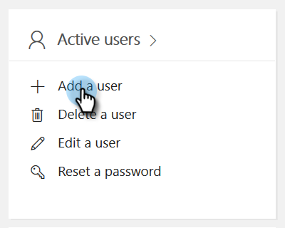
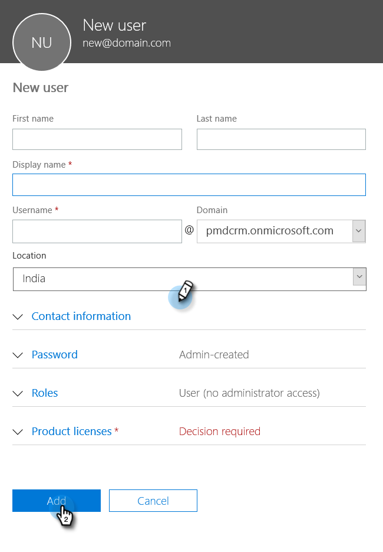
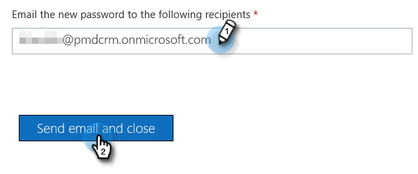

# Passaggio 2 di 4: configurare la soluzione Marketo con la connessione di controllo della password del proprietario della risorsa {#step-2-of-4-set-up-the-marketo-solution-ropc}

Iniziamo creando un account utente.

>[!PREREQUISITES]
>
>[Passaggio 1 di 4: installare la soluzione Marketo con la connessione di controllo password del proprietario della risorsa](/help/marketo/product-docs/crm-sync/microsoft-dynamics-sync/sync-setup/microsoft-dynamics-365-with-ropc-connection/step-1-of-4-install.md){target="_blank"}

## Crea un nuovo utente {#create-a-new-user}

1. Accedere a [!DNL Dynamics]. Fare clic sull&#39;icona [!UICONTROL Settings] e selezionare **[!UICONTROL Advanced Settings]**.

   

1. Fare clic su **[!UICONTROL Settings]** e selezionare **[!UICONTROL Security]**.

   

1. Fai clic su **[!UICONTROL Users]**.

   

1. Fai clic su **[!UICONTROL New]**.

   

1. Fare clic su **[!UICONTROL Add and License Users]** nella nuova finestra.

   

1. Viene visualizzata una nuova scheda. Fai clic su **[!UICONTROL Admin]** nella parte superiore della pagina.

   

1. Viene visualizzata un’altra nuova scheda. Fai clic su **[!UICONTROL Add a user]**.

   

   >[!IMPORTANT]
   >
   >L&#39;utente Sync deve disporre dell&#39;autorizzazione di lettura per la configurazione di Marketo.

1. Immettere tutte le informazioni. Al termine, fare clic su **[!UICONTROL Add]**.

   

   >[!NOTE]
   >
   >Questo nome deve essere un utente di sincronizzazione dedicato e non un account utente CRM esistente. Non deve essere un indirizzo e-mail effettivo.

1. Immettere l&#39;indirizzo di posta elettronica per ricevere le nuove credenziali utente e fare clic su **[!UICONTROL Send email and close]**.

   

## Assegna ruolo utente di sincronizzazione {#assign-sync-user-role}

Assegnare il ruolo Utente di sincronizzazione Marketo solo all&#39;utente di sincronizzazione Marketo. Non è necessario assegnarla ad altri utenti.

>[!NOTE]
>
>Applicabile a Marketo versione 4.0.0.14 e successive. Per le versioni precedenti, tutti gli utenti devono avere il ruolo utente di sincronizzazione. Per aggiornare Marketo, vedere [Aggiorna soluzione Marketo per [!DNL Microsoft Dynamics]](/help/marketo/product-docs/crm-sync/microsoft-dynamics-sync/sync-setup/update-the-marketo-solution-for-microsoft-dynamics.md).

>[!IMPORTANT]
>
>L&#39;impostazione della lingua dell&#39;utente di sincronizzazione [&#x200B; deve essere inglese](https://learn.microsoft.com/en-us/power-platform/admin/enable-languages){target="_blank"}.

1. Torna alla scheda [!UICONTROL Enabled Users] e aggiorna l&#39;elenco degli utenti.

   

1. Passa il puntatore del mouse accanto al nuovo utente di Marketo Sync creato, quindi viene visualizzata una casella di controllo. Fai clic su per selezionarlo.

   

1. Fai clic su **[!UICONTROL Manage Roles]**.

   

1. Selezionare **[!UICONTROL Marketo Sync User]** e fare clic su **[!UICONTROL OK]**.

   

   >[!NOTE]
   >
   >Eventuali aggiornamenti apportati nel CRM dall&#39;utente di sincronizzazione _non_ verranno sincronizzati di nuovo in Marketo.

## Configurare la soluzione Marketo {#configure-marketo-solution}

Ci siamo quasi! Tutto ciò che ci rimane è informare Marketo Solution sul nuovo utente creato.

1. Torna alla sezione [!UICONTROL Advanced Settings] e fai clic sull&#39;icona  accanto a [!UICONTROL Settings], quindi seleziona **[!UICONTROL Marketo Config]**.

   

   >[!NOTE]
   >
   >Se **[!UICONTROL Marketo Config]** non è visualizzato nel menu [!UICONTROL Settings], aggiorna la pagina. Se non funziona, prova a [pubblicare di nuovo la soluzione Marketo](/help/marketo/product-docs/crm-sync/microsoft-dynamics-sync/sync-setup/microsoft-dynamics-365-with-ropc-connection/step-1-of-4-install.md) oppure esci e accedi di nuovo.

1. Fai clic su **[!UICONTROL Default]**.

   

1. Fare clic sul pulsante di ricerca nel campo **[!UICONTROL Marketo User]** e selezionare l&#39;utente di sincronizzazione creato.

   

1. Fai clic sull&#39;icona  nell&#39;angolo in basso a destra per salvare le modifiche.

   

1. Fai clic su **X** in alto a destra per chiudere la schermata.

   

1. Fare clic sull&#39;icona  accanto a [!UICONTROL Settings] e selezionare **[!UICONTROL Solutions]**.

   

1. Fare clic sul pulsante **[!UICONTROL Publish All Customizations]**.

   

>[!MORELIKETHIS]
>
>[Passaggio 3 di 4: connettere la soluzione Marketo con la connessione di controllo password del proprietario della risorsa](/help/marketo/product-docs/crm-sync/microsoft-dynamics-sync/sync-setup/microsoft-dynamics-365-with-ropc-connection/step-3-of-4-set-up.md){target="_blank"}
