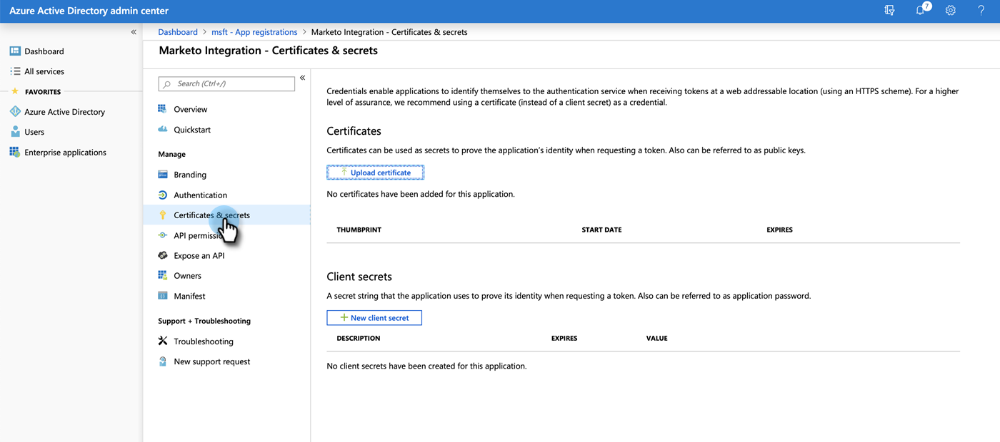

# Passaggio 3 di 4: Configurazione dell’app client su MS Dynamics {#step-3-of-4-set-up-client-app-ms-dynamics-ropc}

>[!PREREQUISITES]
>
>* [Passaggio 1 di 4: Installare la soluzione Marketo con la connessione Controllo password proprietario risorsa](/help/marketo/product-docs/crm-sync/microsoft-dynamics-sync/sync-setup/microsoft-dynamics-365-with-ropc-connection/step-1-of-3-install.md)
>* [Passaggio 2 di 4: Configurare la soluzione Marketo con la connessione Controllo password proprietario risorsa](/help/marketo/product-docs/crm-sync/microsoft-dynamics-sync/sync-setup/microsoft-dynamics-365-with-ropc-connection/step-2-of-3-set-up.md)

1. Vai su https://docs.microsoft.com/en-us/powerapps/developer/common-data-service/walkthrough-register-app-azure-active-directory#create-an-application-registration.

1. Segui tutti i passaggi. Per il passaggio 3, immettere un nome applicazione pertinente (ad esempio, &quot;Integrazione Marketo&quot;). In Tipi di account supportati, seleziona Account solo in questa directory organizzativa.

1. Annotare l&#39;ID applicazione (ClientId). Sarà necessario inserirlo in Marketo in un secondo momento.

1. Concedi il consenso dell’amministratore seguendo i passaggi descritti in [articolo](/help/marketo/product-docs/crm-sync/microsoft-dynamics-sync/sync-setup/grant-consent-for-client-id-and-app-registration.md).

1. Genera un segreto client in Admin Center facendo clic su **Certificati e segreti**.

   

1. Fai clic su **Nuovo segreto client**.

   

1. Aggiungi una descrizione del segreto client e fai clic su **Aggiungi**.

   

   >[!CAUTION]
   >
   >Accertati di prendere nota del valore Segreto client (mostrato nella schermata seguente), in quanto ne avrai bisogno in un secondo momento. Viene mostrato solo una volta e non potrai recuperarlo di nuovo.

   

## Azure AD Federated con AD FS On-Prem {#azure-ad-federated-with-ad-fs-on-prem}

Federated Azure AD to ADFS Onprem richiede la creazione di un criterio di individuazione dell&#39;area iniziale per l&#39;applicazione specifica. Con questo criterio, Azure AD reindirizzerà la richiesta di autenticazione al servizio federativo. A questo scopo, la sincronizzazione hash della password deve essere abilitata in AD Connect. Per ulteriori informazioni, consulta [OAuth con ROPC](https://docs.microsoft.com/en-us/azure/active-directory/develop/v2-oauth-ropc) e [Impostare un criterio hrd per un&#39;applicazione](https://docs.microsoft.com/en-us/azure/active-directory/manage-apps/configure-authentication-for-federated-users-portal#example-set-an-hrd-policy-for-an-application).

Riferimenti aggiuntivi [si trova qui](https://docs.microsoft.com/en-us/azure/active-directory/reports-monitoring/concept-all-sign-ins#:~:text=Interactive%20user%20sign%2Dins%20are,as%20the%20Microsoft%20Authenticator%20app.&amp;text=This%20report%20also%20include%20federated, are%20federated%20to%20Azure%20AD.).

>[!MORELIKETHIS]
>
>* [Passaggio 4 di 4: Connessione della soluzione Marketo con la connessione del controllo password del proprietario della risorsa](/help/marketo/product-docs/crm-sync/microsoft-dynamics-sync/sync-setup/microsoft-dynamics-365-with-ropc-connection/step-4-of-4-connect.md)

