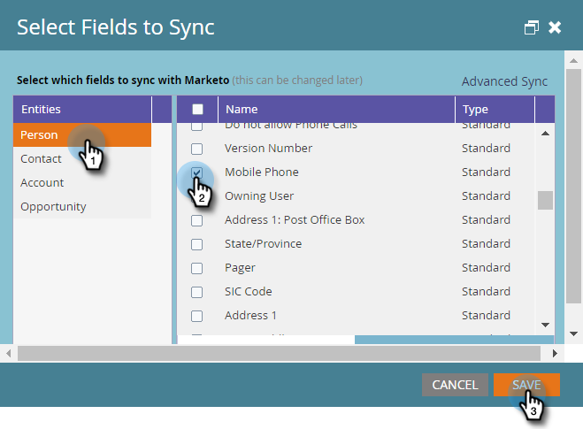

# Passaggio 4 di 4: Connessione della soluzione Marketo con la connessione del controllo password del proprietario della risorsa {#step-4-of-4-connect-the-marketo-solution-ropc}

Questo è l&#39;ultimo passaggio della sincronizzazione. Ci siamo quasi!

>[!PREREQUISITES]
>
>* [Passaggio 1 di 4: Installare la soluzione Marketo con la connessione Controllo password proprietario risorsa](/help/marketo/product-docs/crm-sync/microsoft-dynamics-sync/sync-setup/microsoft-dynamics-365-with-ropc-connection/step-1-of-3-install.md)
>* [Passaggio 2 di 4: Configurare la soluzione Marketo con la connessione Controllo password proprietario risorsa](/help/marketo/product-docs/crm-sync/microsoft-dynamics-sync/sync-setup/microsoft-dynamics-365-with-ropc-connection/step-2-of-3-set-up.md)
>* [Passaggio 3 di 4: Configurazione dell’app client su MS Dynamics](/help/marketo/product-docs/crm-sync/microsoft-dynamics-sync/sync-setup/microsoft-dynamics-365-with-ropc-connection/step-3-of-4-set-up.md)

>[!NOTE]
>
>**Autorizzazioni amministratore richieste**

## Immetti le informazioni utente di Dynamics Sync {#enter-dynamics-sync-user-information}

1. Accedi a Marketo e fai clic su **Amministratore**.

   

1. Fai clic su **CRM**.

   

1. Seleziona **Microsoft**.

   

1. Fai clic su **Modifica** in **Passaggio 1: Immettere le credenziali**.

   

   >[!CAUTION]
   >
   >Assicurati che le tue credenziali siano corrette in quanto non è possibile ripristinare le successive modifiche dello schema dopo l’invio. Se vengono salvate le credenziali errate, sarà necessario ottenere una nuova sottoscrizione Marketo.

1. Inserisci il **Nome utente**, **Password** e Microsoft Dynamics **URL**. Fai clic su **Salva** al termine.

   

   >[!NOTE]
   >
   >* Se il provisioning del tuo Marketo è stato eseguito prima di ottobre 2020, gli ID client e il segreto sono campi facoltativi. Altrimenti, sono obbligatori. L&#39;ottenimento di queste informazioni dipenderà dalla versione di MSD in uso.
   >* Il nome utente in Marketo deve corrispondere al nome utente per l&#39;utente di sincronizzazione in CRM. Il formato può essere `user@domain.com` o DOMINIO\utente.
   >* Se non conosci l’URL, [scopri come trovarlo qui](/help/marketo/product-docs/crm-sync/microsoft-dynamics-sync/sync-setup/view-the-organization-service-url.md).

## Seleziona campi da sincronizzare {#select-fields-to-sync}

1. Fai clic su **Modifica** in **Passaggio 2: Seleziona campi da sincronizzare**.

   

1. Seleziona i campi da sincronizzare in Marketo, in modo che vengano preselezionati. Fai clic su **Salva**.

   

>[!NOTE]
>
>Marketo memorizza un riferimento ai campi da sincronizzare. Se elimini un campo in Dynamics, è consigliabile eseguire questa operazione con la [sincronizzazione disabilitata](/help/marketo/product-docs/crm-sync/salesforce-sync/enable-disable-the-salesforce-sync.md). Quindi aggiorna lo schema in Marketo modificando e salvando il [Seleziona campi da sincronizzare](/help/marketo/product-docs/crm-sync/microsoft-dynamics-sync/microsoft-dynamics-sync-details/microsoft-dynamics-sync-field-sync/editing-fields-to-sync-before-deleting-them-in-dynamics.md).

## Campi di sincronizzazione per un filtro personalizzato {#sync-fields-for-a-custom-filter}

Se hai creato un filtro personalizzato, assicurati di entrare e selezionare i nuovi campi da sincronizzare con Marketo.

1. Vai ad Amministratore e seleziona **Microsoft Dynamics**.

   

1. Fai clic su **Modifica** in Dettagli sincronizzazione campo.

   

1. Scorri verso il basso fino al campo e controllalo. Il nome effettivo deve essere new_synctomkto ma il nome visualizzato può essere qualsiasi cosa. Fai clic su **Salva**.

   

## Abilita sincronizzazione {#enable-sync}

1. Fai clic su **Modifica** in **Passaggio 3: Abilita sincronizzazione**.

   

   >[!CAUTION]
   >
   >Marketo non eseguirà automaticamente il deduplicazione rispetto a una sincronizzazione di Microsoft Dynamics o quando immetti manualmente persone o lead.

1. Leggi tutto nella finestra a comparsa, inserisci il tuo indirizzo e-mail e fai clic su **Avvia sincronizzazione**.

   

1. La prima sincronizzazione potrebbe richiedere alcune ore. Al termine riceverai una notifica e-mail.

   

Ottimo lavoro!
